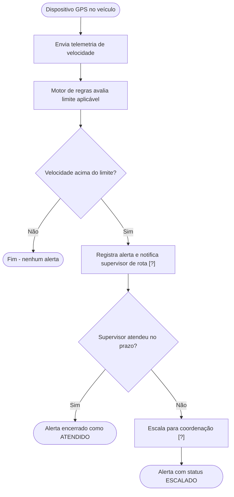
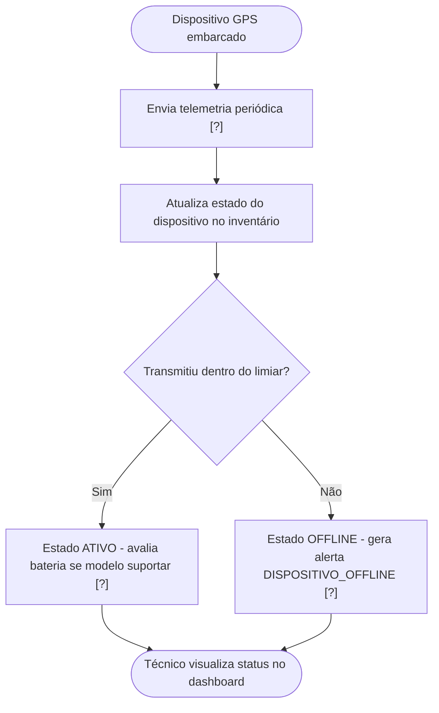
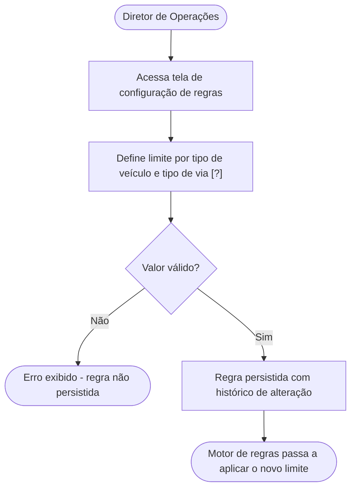
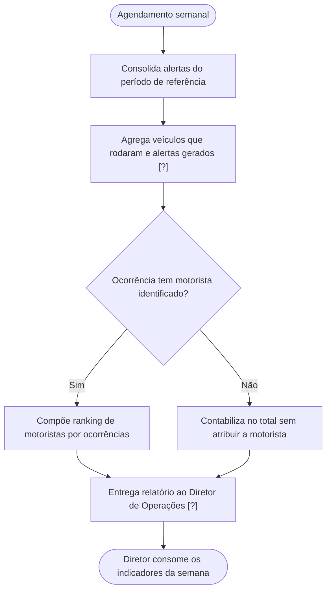
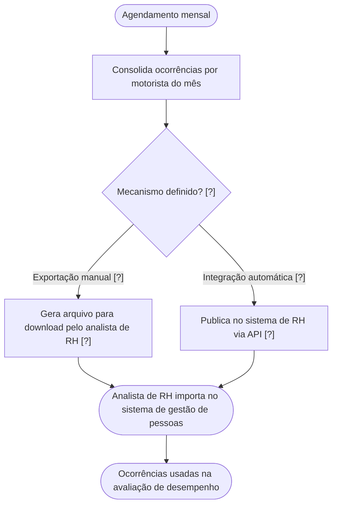
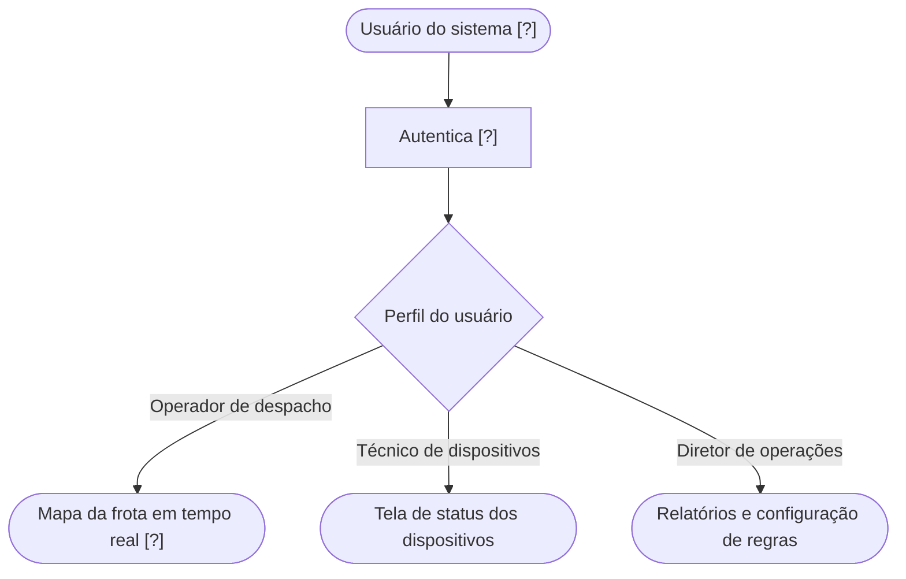
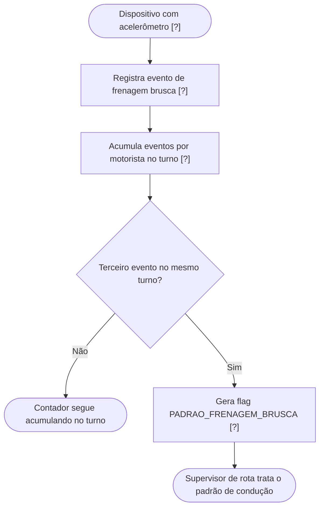

### 1. MAPA DE DOMÍNIOS

| # | Domínio | Descrição (uma linha) | Confiança |
|---|---------|----------------------|-----------|
| D1 | Monitoramento e Alertas de Condução | Detecção de excesso de velocidade e eventos de risco em veículos, com notificação e escalação para supervisores. | **Alta** — dor principal descrita com cenário, impacto (multa, acidente) e fluxo de escalação. |
| D2 | Gestão de Dispositivos (Telemetria/GPS) | Inventário e estado operacional dos rastreadores GPS embarcados: ativo, offline, bateria. | **Alta** — Carlos descreveu o problema (sumiço de 20 min), o estado atual (planilha Excel) e os campos desejados. |
| D3 | Configuração de Regras de Negócio | Parametrização de limites de velocidade por tipo de veículo e por tipo de via, sem depender da TI. | **Média** — necessidade confirmada, mas dimensões de segmentação (veículo, rota, via) e modelo de permissão não foram fechados. |
| D4 | Relatórios e Analytics Gerenciais | Consolidação automática de indicadores operacionais (veículos rodados, alertas gerados, ocorrências por motorista) para diretoria. | **Média** — métricas nomeadas e frequência informada, mas formato de entrega, filtros e período de retenção não. |
| D5 | Integração com RH / Gestão de Pessoas | Envio das ocorrências de motorista para o sistema de gestão de pessoas usado pelo RH. | **Baixa** — sistema não nomeado ("Nomes de sistemas de terceiros não transcritos"), existência de API desconhecida, natureza da integração indefinida. **Requer segunda conversa — com o RH, não com Carlos.** |
| D6 | Manutenção Preditiva | Previsão de necessidade de manutenção a partir do histórico de uso e manutenção da frota. | **Baixa** — explicitamente diferido ("fase dois"), sem métricas, sem definição de "prever", com dado histórico de qualidade declaradamente ruim. |
| D7 | Detecção de Padrão de Condução (Frenagem Brusca) | Uso do acelerômetro dos dispositivos novos para flagrar padrão de frenagem brusca por turno. | **Baixa** — regra de negócio dada (3 eventos/turno), mas o próprio stakeholder não sabe se é release 1 ou 2, e depende de compra de hardware não cotada. |
| D8 | Perfis de Acesso e Visualização Operacional | Três perfis distintos (operador de despacho, técnico de dispositivos, diretor) com visões diferentes do sistema. | **Média** — perfis nomeados e necessidade de cada um declarada em uma frase, sem detalhamento de permissões. |
| D9 | Privacidade e Compliance (LGPD) | Tratamento de dados de localização e comportamento de motoristas sob a LGPD. | **Baixa** — levantado como pergunta aberta pelo próprio stakeholder; nenhuma decisão tomada. **Bloqueante para produção.** |

---

### 2. MAPA DE STAKEHOLDERS

**Carlos Mendonça — Diretor de Operações**
- **Tipo:** negócio (e também usuário final — ele declara explicitamente ser um dos três perfis: "E eu. Três perfis diferentes.")
- **Requisitos que defende:**
  - Alerta automático de excesso de velocidade "em tempo real" [AMBIGUIDADE], sem delay de 5 minutos
  - Escalação para coordenação se o supervisor da rota não atender "em uns minutos" [AMBIGUIDADE]
  - Detecção de dispositivo GPS offline, com alerta distinto do de velocidade
  - Dashboard com status por dispositivo: ativo / offline / bateria baixa
  - Relatório gerencial automático — semanal para o diretor, mensal para o RH
  - Exportação de ocorrências de motorista para o sistema de RH
  - Regras de alerta configuráveis por tipo de veículo e por tipo de via, editáveis sem TI
  - Manutenção preditiva — explicitamente fora do primeiro release
  - Frenagem brusca via acelerômetro — posição declaradamente indefinida ("não sei se é primeira versão ou segunda")
- **Conflitos:** nenhum conflito direto identificado com os demais participantes. Ver [CONFLITO INTERNO] abaixo.
- **[CONFLITO INTERNO — mesmo stakeholder]:** Carlos afirma que o primeiro release ("pelo menos alertas e dashboard") precisa estar pronto antes do board de julho, e ao mesmo tempo levanta a LGPD como bloqueio não resolvido para produção ("alguém vai ter que responder antes de ir pra produção"). A data e a condição de entrada em produção não foram conciliadas na reunião. Decisão humana — não resolvida aqui.

**Priya — TI / Infraestrutura**
- **Tipo:** técnico
- **Requisitos/restrições que defende:**
  - Levantar existência de API no sistema de RH antes de definir tipo de integração (restrição técnica, não requisito de negócio)
  - Levantar custo e prazo de instalação de novos rastreadores com o fornecedor de contrato vigente
  - Envolver compliance/jurídico na questão LGPD antes de produção
  - Registro de frenagem brusca como "requisito futuro candidato" — ela mesma classificou assim
- **Conflitos:** nenhum conflito de posição. Priya atua como qualificadora de risco, não como proponente de escopo.

**Marcus — Consultor externo (facilitador do discovery)**
- **Tipo:** técnico (papel de analista/facilitador)
- **Requisitos que defende:** nenhum próprio. Consolidou o escopo em cinco itens e obteve confirmação de Carlos: alertas de velocidade em tempo real com escalação; monitoramento de status dos dispositivos GPS incluindo bateria e acelerômetro; dashboard gerencial automático; exportação de ocorrências para RH; manutenção preditiva como fase dois.
- **Conflitos:** nenhum.
- **Observação:** na consolidação de Marcus, o acelerômetro aparece dentro do escopo confirmado ("incluindo bateria e acelerômetro"), enquanto Carlos duas vezes declarou não saber se é release 1 ou 2, e Priya registrou como "requisito futuro candidato". **[CONFLITO]** entre a síntese do facilitador e a posição do stakeholder de negócio. Ver Pergunta 6.

**Stakeholders citados mas ausentes da reunião — todos os requisitos abaixo recebem [VALIDAR COM EQUIPE]:**

| Papel citado | Requisito atribuído | Status |
|---|---|---|
| Supervisor de rota | Recebe o alerta de velocidade em primeira instância e deve "atender" | [VALIDAR COM EQUIPE] — não participou; não confirmou canal, disponibilidade nem o que significa "atender" |
| Coordenação | Recebe a escalação quando o supervisor não atende | [VALIDAR COM EQUIPE] — não participou; papel e responsáveis não nomeados |
| Diretor (superior de Carlos) | Consome relatório semanal; é o cliente da apresentação de julho | [VALIDAR COM EQUIPE] — requisito relatado em segunda mão |
| RH | Consome ocorrências de motorista mensalmente para avaliação de desempenho | [VALIDAR COM EQUIPE] — pediram a exportação, mas não participaram; sistema, API e formato desconhecidos |
| Operador de despacho | Usuário final do mapa em tempo real | [VALIDAR COM EQUIPE] — perfil declarado por Carlos, sem entrevista própria |
| Técnico de dispositivos | Usuário final da tela de status de dispositivos; hoje mantém a planilha Excel | [VALIDAR COM EQUIPE] — perfil declarado por Carlos, sem entrevista própria |
| Jurídico / Compliance | Deve responder sobre LGPD antes da produção | [VALIDAR COM EQUIPE] — ainda não acionado |
| Fornecedor de rastreadores | Cotação e prazo de instalação de novos dispositivos | [VALIDAR COM EQUIPE] — Priya assumiu a ação, sem prazo definido |

**Distinção requisito de negócio × restrição técnica:**
- **Requisitos de negócio (Carlos):** alertas, escalação, dashboard, relatórios, exportação RH, regras configuráveis.
- **Restrições técnicas conhecidas (Priya + contexto):** dispositivos GPS antigos não enviam nível de bateria nem acelerômetro; sistema legado de 2016 sem API documentada; inventário de dispositivos existe apenas em planilha Excel; histórico de manutenção em duas planilhas com formato "orgânico" (dois anos); existência de API no sistema de RH desconhecida.

---

### 3. ESTRUTURA DE ÉPICOS

**E1 — Alertas de Velocidade com Escalação**
- **Descrição:** Detectar excesso de velocidade por veículo e notificar o supervisor da rota, com escalação automática para a coordenação em caso de não atendimento.
- **Complexidade:** **G** — envolve ingestão contínua de telemetria, motor de regras, máquina de estados de escalação e canal de notificação, todos sobre um legado de 2016 sem API documentada.
- **Domínio:** D1 — Monitoramento e Alertas de Condução

**E2 — Gestão e Monitoramento de Dispositivos GPS**
- **Descrição:** Substituir a planilha de controle por um inventário vivo com o estado de cada rastreador (ativo, offline com duração, bateria) e alerta próprio para dispositivo offline.
- **Complexidade:** **M** — CRUD de inventário com telemetria de heartbeat; a complexidade extra vem da heterogeneidade do parque (dispositivos antigos sem campo de bateria).
- **Domínio:** D2 — Gestão de Dispositivos

**E3 — Configuração de Regras de Alerta**
- **Descrição:** Permitir que o Diretor de Operações crie e edite limites de velocidade por tipo de veículo e por tipo de via sem acionar a TI.
- **Complexidade:** **M** — modelagem de regras parametrizadas, resolução de precedência entre regras e interface de administração; a complexidade está na semântica das regras, não no volume.
- **Domínio:** D3 — Configuração de Regras de Negócio

**E4 — Relatórios Gerenciais Automáticos**
- **Descrição:** Gerar e entregar automaticamente os indicadores semanais de operação que hoje são compilados manualmente em duas horas de trabalho por semana.
- **Complexidade:** **M** — agregação sobre dados já capturados pelos épicos E1 e E2, mais agendamento e entrega; depende de E1/E2 existirem.
- **Domínio:** D4 — Relatórios e Analytics

**E5 — Exportação de Ocorrências para o Sistema de RH**
- **Descrição:** Disponibilizar mensalmente as ocorrências por motorista ao sistema de gestão de pessoas do RH, para uso em avaliação de desempenho.
- **Complexidade:** **[NÃO ESTIMÁVEL]** — não é possível atribuir P/M/G/GG: o sistema de destino não foi nomeado, a existência de API é desconhecida ("Não tenho a menor ideia"), e a diferença entre exportação manual de arquivo e integração autenticada bidirecional é de uma ordem de magnitude. Estimar aqui seria [ESPECIFICAÇÃO INVENTADA].
- **Domínio:** D5 — Integração com RH

**E6 — Visualização Operacional por Perfil**
- **Descrição:** Entregar a cada um dos três perfis declarados (operador de despacho, técnico de dispositivos, diretor) a visão que ele precisa: mapa em tempo real, status de dispositivos e relatórios/configuração.
- **Complexidade:** **G** — três interfaces distintas mais controle de acesso; o mapa em tempo real é o item mais pesado e ainda não tem requisito de latência.
- **Domínio:** D8 — Perfis de Acesso e Visualização Operacional

**E7 — Detecção de Frenagem Brusca (candidato — posição em release não definida)**
- **Descrição:** Usar o acelerômetro dos dispositivos novos para sinalizar ao supervisor motoristas com três ou mais eventos de frenagem brusca em um turno.
- **Complexidade:** **G** — depende de aquisição e instalação de hardware em parte dos 140 veículos, de definição do que constitui um "evento de frenagem brusca" e de processamento de sinal do acelerômetro, capacidade não confirmada no time.
- **Domínio:** D7 — Detecção de Padrão de Condução
- **Status:** [VALIDAR COM EQUIPE] — [CONFLITO] entre a consolidação de Marcus (dentro do escopo) e a posição de Carlos e Priya (candidato futuro).

**E8 — Manutenção Preditiva (fase dois — fora do primeiro release)**
- **Descrição:** Prever necessidade de manutenção a partir do histórico de uso dos veículos.
- **Complexidade:** **GG** — o próprio stakeholder reconhece a complexidade; o insumo é de duas planilhas com dois anos de histórico em formato "orgânico", o que implica esforço de normalização de dado antes de qualquer modelagem. Não há definição de horizonte de previsão nem de acurácia aceitável.
- **Domínio:** D6 — Manutenção Preditiva
- **Status:** explicitamente diferido por Carlos. Não decomposto em histórias neste output.

**E9 — Conformidade LGPD para Dados de Localização e Comportamento**
- **Descrição:** Estabelecer base legal, consentimento e controles de tratamento para dados de localização e comportamento de motoristas.
- **Complexidade:** **[NÃO ESTIMÁVEL]** — depende inteiramente de um parecer jurídico que ainda não existe; o escopo técnico (anonimização? retenção? consentimento? DPIA?) só é definível após esse parecer.
- **Domínio:** D9 — Privacidade e Compliance
- **Status:** bloqueio de produção declarado pelo próprio stakeholder.

---

### 4. USER STORIES

---

#### US-01 — Alerta automático de excesso de velocidade

**a. Card:**
> Como **supervisor de rota**, quero **receber um alerta automático quando um veículo sob minha responsabilidade ultrapassar o limite de velocidade configurado**, para que **eu possa contatar o motorista antes que a infração gere multa ou acidente**.

**b. Validação INVEST:**
- **Independent:** ⚠️ FAIL parcial — depende de US-05 (configuração de limites) para saber qual limite aplicar. Mitigável: US-01 pode ser desenvolvida contra um limite único fixo, replicando o comportamento atual do legado ("Hoje a gente usa um limite único pra tudo"), e US-05 substitui a fonte do limite depois. **[INVEST-FAIL: Independent]** — motivo: acoplamento à fonte de configuração de limite; ação: implementar contra limite fixo mockado, e a história permanece desenvolvível.
- **Negotiable:** PASS — canal de entrega, formato e conteúdo do alerta são negociáveis no planning.
- **Valuable:** PASS — endereça diretamente as duas perdas nomeadas por Carlos (multa evitável e acidente).
- **Estimable:** **FAIL** — **[INVEST-FAIL: Estimable]** — a latência aceitável não foi definida ("Quanto é 'em tempo real'? Não sei te dizer um número exato. Mas rápido."). A diferença de esforço entre polling de 30 s sobre o legado e um pipeline de streaming sub-segundo é grande demais para uma estimativa honesta. **Bloqueia o card do Jira.**
- **Small:** PASS — a detecção e a notificação em primeira instância cabem em um sprint, uma vez definida a latência. A escalação foi separada em US-02.
- **Testable:** PASS condicional — testável assim que a latência-alvo existir; os demais critérios já são verificáveis.

**c. Critérios de aceite (Gherkin):**

```gherkin
Cenário: Veículo excede o limite configurado e o supervisor é notificado
  Dado que o veículo VE-001 está associado ao supervisor de rota SUP-01
  E que o limite de velocidade aplicável ao VE-001 é de 80 km/h
  E que o dispositivo GPS do VE-001 está com status "ativo"
  Quando o dispositivo do VE-001 reportar velocidade de 95 km/h
  Então um alerta do tipo "EXCESSO_VELOCIDADE" é registrado com placa, velocidade
       reportada, limite aplicado e timestamp da leitura
  E o alerta é entregue ao supervisor SUP-01 em até [A CONFIRMAR COM STAKEHOLDER] segundos
       contados a partir do timestamp da leitura
  E o status do alerta passa a "AGUARDANDO_ATENDIMENTO"

Cenário: Veículo dentro do limite não gera alerta
  Dado que o veículo VE-002 tem limite de velocidade aplicável de 80 km/h
  Quando o dispositivo do VE-002 reportar velocidade de 80 km/h
  Então nenhum alerta do tipo "EXCESSO_VELOCIDADE" é registrado para o VE-002

Cenário (edge case): Veículo excede o limite enquanto o dispositivo está offline
  Dado que o veículo VE-003 está com o dispositivo GPS em status "offline"
  Quando não houver leitura de velocidade do VE-003 por [A CONFIRMAR COM STAKEHOLDER] minutos
  Então nenhum alerta do tipo "EXCESSO_VELOCIDADE" é gerado para o VE-003
  E o tratamento passa para o alerta de dispositivo offline definido em US-04

Cenário (edge case): Leituras repetidas do mesmo excesso não duplicam o alerta
  Dado que existe um alerta "EXCESSO_VELOCIDADE" ativo para o veículo VE-001
       com status "AGUARDANDO_ATENDIMENTO"
  Quando o dispositivo do VE-001 reportar nova velocidade acima do limite
       dentro da mesma janela de agrupamento de [A CONFIRMAR COM STAKEHOLDER] minutos
  Então nenhum novo alerta é criado
  E a velocidade máxima registrada no alerta existente é atualizada para o maior valor lido
```

**d. Dependências:**
- US-05 (regras de limite configurável) — mitigável por limite fixo na primeira iteração
- Acesso à telemetria de velocidade dos rastreadores — a transcrição não estabelece **como** o software novo lê os dados dos dispositivos. O sistema de 2016 é descrito como sem API documentada. [DEPENDÊNCIA NÃO MAPEADA]
- Cadastro veículo → supervisor de rota — não existe nenhuma menção a esse cadastro no input, mas o alerta é endereçado "pro supervisor direto da rota", o que o pressupõe. [DEPENDÊNCIA NÃO MAPEADA]
- Canal de notificação (SMS, push, e-mail, app) — não mencionado no input

**e. Notas técnicas:**
- A arquitetura de ingestão (polling do legado × recepção direta dos dispositivos × streaming) é indefinida e é a variável que mais influencia a estimativa. Decisão do time de arquitetura.
- A janela de agrupamento/deduplicação de alertas é uma decisão de produto que ainda não foi tomada; sem ela, um veículo em excesso sustentado gera um alerta por leitura.
- Nenhuma menção no input a comportamento offline-first ou buffer de leituras no dispositivo.

---

#### US-02 — Escalação de alerta não atendido

**a. Card:**
> Como **coordenador de operações**, quero **receber automaticamente os alertas de velocidade que o supervisor da rota não atendeu dentro do prazo definido**, para que **nenhuma ocorrência de risco fique sem tratamento por ausência, turno ou intervalo do supervisor**.

**b. Validação INVEST:**
- **Independent:** FAIL — **[INVEST-FAIL: Independent]** — não faz sentido sem US-01; é a continuação da máquina de estados do alerta. É um pré-requisito real e unidirecional (não circular): US-01 → US-02.
- **Negotiable:** PASS
- **Valuable:** PASS — resolve o "hoje isso não existe, é tudo boca a boca" e o problema de cobertura de turno relatado por Carlos.
- **Estimable:** **FAIL** — **[INVEST-FAIL: Estimable]** — dois parâmetros indefinidos: o prazo de escalação ("uns minutos" [AMBIGUIDADE]) e a definição operacional de "atender". Se "atender" exige um aceite explícito no sistema, a história inclui uma interface de reconhecimento que hoje não existe em lugar nenhum. **Bloqueia o card do Jira.**
- **Small:** PASS — assumindo um único nível de escalação, cabe em um sprint.
- **Testable:** PASS condicional — depende de "atender" virar um evento verificável.

**c. Critérios de aceite (Gherkin):**

```gherkin
Cenário: Alerta não atendido escala para a coordenação
  Dado que existe um alerta "EXCESSO_VELOCIDADE" para o veículo VE-001
       com status "AGUARDANDO_ATENDIMENTO" atribuído ao supervisor SUP-01
  E que o prazo de atendimento configurado é de [A CONFIRMAR COM STAKEHOLDER] minutos
  Quando o prazo de atendimento expirar sem que o alerta tenha recebido
       um registro de atendimento do SUP-01
  Então o status do alerta passa a "ESCALADO"
  E o alerta é entregue ao coordenador responsável pela rota do VE-001
  E o histórico do alerta registra o timestamp da escalação e o motivo "PRAZO_EXPIRADO"

Cenário (edge case): Alerta atendido dentro do prazo não escala
  Dado que existe um alerta "EXCESSO_VELOCIDADE" com status "AGUARDANDO_ATENDIMENTO"
       atribuído ao supervisor SUP-01
  E que o prazo de atendimento configurado é de [A CONFIRMAR COM STAKEHOLDER] minutos
  Quando o SUP-01 registrar o atendimento antes da expiração do prazo
  Então o status do alerta passa a "ATENDIDO"
  E nenhuma notificação é entregue ao coordenador

Cenário (edge case): Coordenador também não atende
  Dado que existe um alerta com status "ESCALADO" atribuído ao coordenador
  Quando o prazo de atendimento do nível de coordenação expirar sem registro de atendimento
  Então [A CONFIRMAR COM STAKEHOLDER] — o comportamento após o segundo nível
       não foi definido no discovery (não há terceiro nível descrito)
```

> ⚠️ O terceiro cenário **não é implementável** como está. Está registrado deliberadamente como lacuna, não como especificação. Ver Pergunta 3.

**d. Dependências:**
- US-01 (pré-requisito real)
- Cadastro rota → supervisor → coordenador, com a hierarquia de escalação. Não mencionado no input. [DEPENDÊNCIA NÃO MAPEADA]
- Mecanismo de registro de atendimento (interface ou confirmação por canal) — não descrito no input
- Canal de notificação da coordenação — não descrito no input

**e. Notas técnicas:**
- Escalação por expiração de prazo exige agendamento confiável por alerta (scheduler ou fila com delay). Decisão de arquitetura não abordada na reunião.
- Não há no input nenhuma menção a cobertura de plantão/turno para a coordenação, embora o problema original seja justamente lacuna de turno.

---

#### US-03 — Registro de status dos dispositivos GPS no dashboard

**a. Card:**
> Como **técnico de dispositivos**, quero **visualizar em uma única tela o estado atual de cada rastreador GPS da frota (ativo, offline, bateria baixa)**, para que **eu deixe de depender da planilha Excel atualizada manualmente para saber quais dispositivos precisam de intervenção**.

**b. Validação INVEST:**
- **Independent:** PASS — pode ser construída a partir da telemetria de heartbeat, sem depender de US-01 ou US-05.
- **Negotiable:** PASS — layout, ordenação e filtros são negociáveis.
- **Valuable:** PASS — substitui um controle que hoje é "planilha do Excel que o técnico atualiza quando lembra".
- **Estimable:** PASS condicional — a lista de estados é fechada e conhecida (ativo, offline, bateria baixa); o esforço depende do mesmo acesso à telemetria de US-01, mas a incerteza é menor porque não há requisito de latência.
- **Small:** PASS.
- **Testable:** PASS — estados são discretos e verificáveis.

**c. Critérios de aceite (Gherkin):**

```gherkin
Cenário: Técnico visualiza o estado atual da frota de dispositivos
  Dado que existem 140 veículos cadastrados, cada um com um dispositivo GPS associado
  E que o dispositivo DEV-010 enviou telemetria há menos do limiar de inatividade
  E que o dispositivo DEV-020 não envia telemetria há mais do limiar de inatividade
  Quando o técnico de dispositivos abrir a tela de status de dispositivos
  Então o DEV-010 é exibido com status "ATIVO"
  E o DEV-020 é exibido com status "OFFLINE" acompanhado do tempo decorrido
       desde a última telemetria recebida

Cenário: Dispositivo novo reporta bateria abaixo do limiar
  Dado que o dispositivo DEV-030 é de modelo que transmite nível de bateria
  E que o limiar de bateria baixa configurado é de [A CONFIRMAR COM STAKEHOLDER] %
  Quando o DEV-030 reportar nível de bateria abaixo desse limiar
  Então o DEV-030 é exibido com o indicador "BATERIA_BAIXA"
  E o valor percentual reportado é exibido junto ao indicador

Cenário (edge case): Dispositivo antigo não transmite nível de bateria
  Dado que o dispositivo DEV-040 é de modelo que não transmite nível de bateria
  Quando o técnico de dispositivos abrir a tela de status de dispositivos
  Então o DEV-040 é exibido com indicador de bateria "NAO_DISPONIVEL"
  E o DEV-040 não é contabilizado no total de dispositivos com bateria baixa

Cenário (edge case): Frota sem dispositivo cadastrado para um veículo
  Dado que o veículo VE-099 não possui dispositivo GPS associado
  Quando o técnico de dispositivos abrir a tela de status de dispositivos
  Então o VE-099 é exibido na lista com status "SEM_DISPOSITIVO"
```

**d. Dependências:**
- Cadastro/inventário de dispositivos e sua associação a veículos — hoje existe apenas como planilha Excel. Migração dessa planilha não foi discutida. [DEPENDÊNCIA NÃO MAPEADA]
- Acesso à telemetria (mesma dependência de US-01)
- Metadado que identifique o modelo/geração do dispositivo, para distinguir os que transmitem bateria dos que não transmitem — não mencionado no input, mas indispensável para o terceiro cenário

**e. Notas técnicas:**
- A distinção "novo × antigo" precisa ser um atributo de dado, não uma inferência por ausência de campo — ausência de campo de bateria também pode significar falha de transmissão.
- Carlos não distingue "dispositivo morreu" de "área sem cobertura" ("a gente não sabe se é o dispositivo que morreu, se é área sem cobertura"). O sistema, com os dados descritos, **também não conseguirá distinguir**. Isso não é resolvível por software com a telemetria disponível — é uma limitação a comunicar ao stakeholder, não um requisito a implementar. Ver Pergunta 5.

---

#### US-04 — Alerta de dispositivo offline

**a. Card:**
> Como **técnico de dispositivos**, quero **ser alertado quando um rastreador GPS ficar sem transmitir por mais tempo que o limiar definido**, para que **eu possa agir sobre o dispositivo em vez de descobrir a falha só quando o veículo sumir do mapa**.

**b. Validação INVEST:**
- **Independent:** PASS — independente de US-01 e US-02; o próprio Carlos separa as duas coisas ("vira um alerta diferente do de velocidade").
- **Negotiable:** PASS
- **Valuable:** PASS — o input traz o caso concreto: "o caminhão some do mapa por vinte minutos e a gente não sabe".
- **Estimable:** **FAIL** — **[INVEST-FAIL: Estimable]** — o limiar de tempo não foi definido ("Se ficou offline além de um certo tempo" [AMBIGUIDADE]). Os "vinte minutos" citados por Carlos descrevem um **sintoma observado**, não um limiar acordado — tratá-los como limiar seria [ESPECIFICAÇÃO INVENTADA]. **Bloqueia o card do Jira.**
- **Small:** PASS
- **Testable:** PASS condicional — testável assim que o limiar existir.

**c. Critérios de aceite (Gherkin):**

```gherkin
Cenário: Dispositivo ultrapassa o limiar de inatividade e gera alerta
  Dado que o dispositivo DEV-050 está com status "ATIVO"
  E que o limiar de inatividade configurado é de [A CONFIRMAR COM STAKEHOLDER] minutos
  Quando o tempo desde a última telemetria do DEV-050 ultrapassar esse limiar
  Então o status do DEV-050 passa a "OFFLINE"
  E um alerta do tipo "DISPOSITIVO_OFFLINE" é registrado com o identificador
       do dispositivo, a placa do veículo e o timestamp da última telemetria recebida
  E o alerta é entregue ao técnico de dispositivos

Cenário (edge case): Dispositivo volta a transmitir e o alerta é encerrado
  Dado que existe um alerta "DISPOSITIVO_OFFLINE" ativo para o DEV-050
  Quando o DEV-050 voltar a enviar telemetria
  Então o status do DEV-050 passa a "ATIVO"
  E o alerta é encerrado com a duração total do período offline em minutos

Cenário (edge case): Oscilação de sinal não gera múltiplos alertas
  Dado que existe um alerta "DISPOSITIVO_OFFLINE" ativo para o DEV-050
  Quando o DEV-050 enviar telemetria e voltar a ficar sem transmitir
       dentro da janela de estabilização de [A CONFIRMAR COM STAKEHOLDER] minutos
  Então nenhum novo alerta "DISPOSITIVO_OFFLINE" é criado para o DEV-050
  E o alerta existente permanece ativo
```

**d. Dependências:**
- US-03 (inventário e telemetria de dispositivos) — pré-requisito real
- Canal de notificação do técnico — não mencionado no input

**e. Notas técnicas:**
- Detectar **ausência** de evento exige um mecanismo diferente de detectar um evento (varredura periódica ou watchdog por dispositivo). Não foi abordado na reunião.
- A janela de estabilização do terceiro cenário é uma proteção contra ruído que **não foi pedida por Carlos** — ver flag de gold plating na Seção 6.

---

#### US-05 — Configuração de limites de velocidade por tipo de veículo e tipo de via

**a. Card:**
> Como **diretor de operações**, quero **cadastrar e alterar limites de velocidade por tipo de veículo e por tipo de via sem depender da TI**, para que **eu possa refletir uma mudança de limite do DETRAN nas regras de alerta no mesmo dia em que ela é publicada**.

**b. Validação INVEST:**
- **Independent:** PASS — a tela de configuração e o modelo de regras podem ser construídos antes de US-01 consumi-los.
- **Negotiable:** PASS
- **Valuable:** PASS — remove uma limitação explícita do legado ("Hoje a gente usa um limite único pra tudo porque o sistema não suporta outra coisa").
- **Estimable:** ⚠️ PASS parcial — **[INVEST-FAIL: Estimable]** parcial: o número de tipos de veículo e de tipos de via não foi enumerado. Carlos deu apenas exemplos ("caminhão pesado", "van leve", "estrada", "perímetro urbano") — não uma lista fechada. **[ANTI-PADRÃO: ESCOPO IMPLICITAMENTE INFINITO]**. Estimável se a lista for fechada antes do planning.
- **Small:** PASS, se a lista de tipos for fechada.
- **Testable:** PASS.

**c. Critérios de aceite (Gherkin):**

```gherkin
Cenário: Diretor cadastra limite específico para uma combinação veículo/via
  Dado que o diretor de operações está autenticado com perfil de configuração de regras
  E que existe o tipo de veículo "CAMINHAO_PESADO" e o tipo de via "RODOVIA"
  Quando ele salvar a regra "CAMINHAO_PESADO em RODOVIA = 80 km/h"
  Então a regra é persistida com autor, timestamp e valor anterior
  E a próxima avaliação de velocidade de um veículo do tipo "CAMINHAO_PESADO"
       trafegando em via do tipo "RODOVIA" usa 80 km/h como limite

Cenário: Alteração de limite passa a valer sem intervenção da TI
  Dado que existe a regra "VAN_LEVE em PERIMETRO_URBANO = 60 km/h"
  Quando o diretor de operações alterar o valor da regra para 50 km/h e salvar
  Então a regra passa a valer com o novo valor sem necessidade de deploy
  E o histórico da regra registra o valor anterior 60 km/h, o novo valor 50 km/h,
       o autor e o timestamp da alteração

Cenário (edge case): Combinação veículo/via sem regra cadastrada
  Dado que não existe regra cadastrada para o tipo de veículo "VAN_LEVE"
       em via do tipo "RODOVIA"
  Quando um veículo do tipo "VAN_LEVE" trafegar em via do tipo "RODOVIA"
  Então o limite aplicado é o limite padrão da frota
  E a avaliação registra que foi usado o limite padrão, não uma regra específica

Cenário (edge case): Valor de limite inválido é rejeitado
  Dado que o diretor de operações está na tela de configuração de regras
  Quando ele tentar salvar uma regra com limite igual a 0 ou negativo
  Então a regra não é persistida
  E a tela exibe a mensagem de erro identificando o campo inválido
```

**d. Dependências:**
- Cadastro de tipos de veículo, com cada veículo da frota classificado. Não mencionado no input. [DEPENDÊNCIA NÃO MAPEADA]
- **Classificação de via por tipo (rodovia × perímetro urbano) a partir da posição GPS.** O input não menciona nenhuma fonte de dados que forneça isso. Esta é a dependência mais séria de toda a US-05: sem uma base cartográfica com classificação viária, o critério "por rota/via" é inimplementável. [DEPENDÊNCIA NÃO MAPEADA] + [VIABILIDADE TÉCNICA SILENCIOSA]
- Controle de acesso por perfil (US-06)

**e. Notas técnicas:**
- Carlos oscila entre "por rota" (Priya perguntou "por tipo de veículo ou por rota?") e "por tipo de via" (a resposta dele fala de estrada × perímetro urbano). São modelos de dados diferentes: rota é uma entidade da operação, tipo de via é um atributo geográfico externo. Ver Pergunta 7.
- Precedência entre regras (o que vence quando veículo e via apontam limites diferentes) não foi discutida e precisa ser definida antes da implementação.

---

#### US-06 — Acesso segmentado por perfil de usuário

**a. Card:**
> Como **diretor de operações**, quero **que cada perfil de usuário (operador de despacho, técnico de dispositivos, diretor) acesse apenas as funcionalidades pertinentes ao seu papel**, para que **cada usuário encontre sua informação sem navegar por telas que não usa e sem alterar configurações fora da sua alçada**.

**b. Validação INVEST:**
- **Independent:** PASS — o modelo de perfis pode ser construído independentemente das telas que ele protege.
- **Negotiable:** PASS
- **Valuable:** PASS — os três perfis e suas necessidades foram declarados explicitamente por Carlos.
- **Estimable:** PASS — três perfis, escopo fechado.
- **Small:** PASS.
- **Testable:** PASS.

**c. Critérios de aceite (Gherkin):**

```gherkin
Cenário: Operador de despacho acessa o mapa da frota
  Dado que existe um usuário com perfil "OPERADOR_DESPACHO"
  Quando ele autenticar no sistema
  Então a tela de mapa da frota é exibida
  E os itens de menu de configuração de regras de alerta não são exibidos

Cenário: Técnico de dispositivos acessa o status dos dispositivos
  Dado que existe um usuário com perfil "TECNICO_DISPOSITIVOS"
  Quando ele autenticar no sistema
  Então a tela de status de dispositivos é exibida
  E os itens de menu de configuração de regras de alerta não são exibidos

Cenário: Diretor acessa relatórios e configuração de regras
  Dado que existe um usuário com perfil "DIRETOR_OPERACOES"
  Quando ele autenticar no sistema
  Então a tela de relatórios gerenciais é exibida
  E a tela de configuração de regras de alerta está acessível

Cenário (edge case): Acesso direto a rota fora do perfil é negado
  Dado que existe um usuário autenticado com perfil "OPERADOR_DESPACHO"
  Quando ele requisitar diretamente o endpoint de alteração de regras de alerta
  Então a requisição retorna HTTP 403
  E nenhuma alteração é persistida nas regras
```

**d. Dependências:**
- Mecanismo de autenticação. **Nada no input menciona como os usuários se autenticam** — não há menção a diretório corporativo, SSO ou base de usuários própria. [DEPENDÊNCIA NÃO MAPEADA]

**e. Notas técnicas:**
- Carlos citou três perfis, mas o fluxo de alertas envolve outros dois papéis (supervisor de rota e coordenação) que precisarão de acesso ao sistema para "atender" alertas. **São cinco papéis no sistema, não três.** Ver Pergunta 4.
- Nenhum requisito de segurança foi declarado além da segmentação implícita. Padrão de compliance a definir junto com a LGPD.

---

#### US-07 — Relatório gerencial semanal automático

**a. Card:**
> Como **diretor de operações**, quero **receber automaticamente o relatório semanal com o total de veículos que rodaram, o total de alertas gerados e o ranking de motoristas por número de ocorrências**, para que **eu deixe de gastar duas horas por semana exportando e consolidando esses dados manualmente no Excel**.

**b. Validação INVEST:**
- **Independent:** FAIL — **[INVEST-FAIL: Independent]** — depende de US-01 e US-04 existirem, pois os alertas são a matéria-prima do relatório. Pré-requisito real e unidirecional.
- **Negotiable:** PASS — formato e canal de entrega são negociáveis.
- **Valuable:** PASS — economia mensurável declarada pelo stakeholder (duas horas/semana).
- **Estimable:** ⚠️ PASS parcial — as três métricas foram nomeadas com precisão. Faltam: definição de "veículo rodou", canal de entrega e formato. Estimável com margem.
- **Small:** PASS.
- **Testable:** PASS.

**c. Critérios de aceite (Gherkin):**

```gherkin
Cenário: Relatório semanal é gerado e entregue automaticamente
  Dado que o período de referência é a semana anterior fechada
  E que nesse período 132 veículos registraram ao menos uma telemetria de deslocamento
  E que foram registrados 47 alertas de qualquer tipo
  Quando o agendamento semanal do relatório for executado
  Então o relatório é gerado contendo o total de 132 veículos que rodaram,
       o total de 47 alertas gerados e a lista de motoristas ordenada de forma
       decrescente por número de ocorrências no período
  E o relatório é entregue ao diretor de operações pelo canal configurado

Cenário (edge case): Semana sem nenhum alerta registrado
  Dado que o período de referência é a semana anterior fechada
  E que nenhum alerta foi registrado nesse período
  Quando o agendamento semanal do relatório for executado
  Então o relatório é gerado com total de alertas igual a 0
  E a seção de ranking de motoristas é exibida vazia
  E o relatório é entregue ao diretor de operações

Cenário (edge case): Ocorrência sem motorista identificado
  Dado que existe um alerta registrado no período sem motorista associado
  Quando o relatório semanal for gerado
  Então esse alerta é contabilizado no total de alertas gerados
  E é agrupado na linha "MOTORISTA_NAO_IDENTIFICADO" do ranking
```

**d. Dependências:**
- US-01, US-04 (fonte dos alertas)
- **Associação motorista → veículo → turno.** O relatório exige atribuir ocorrências a motoristas, e **nada no input descreve como o sistema sabe quem está dirigindo qual veículo**. Esta é uma dependência de primeira grandeza. [DEPENDÊNCIA NÃO MAPEADA]
- Definição de "veículo rodou" (qualquer telemetria? deslocamento mínimo? ignição?) — não definida no input
- Canal de entrega do relatório — não definido no input

**e. Notas técnicas:**
- Sem identificação de motorista, as métricas 1 e 2 são entregáveis e a métrica 3 (ranking de motoristas) não é. Uma fatia menor da história pode entregar as duas primeiras.
- O relatório mensal para o RH tem o mesmo insumo, mas destino e periodicidade diferentes — está isolado em US-08 para não violar o I do INVEST. **[ANTI-PADRÃO: REQUISITO DUPLO]** detectado na fala original ("Semanal pro diretor. Mensal pro RH") e resolvido por decomposição.

---

#### US-08 — Exportação mensal de ocorrências de motorista para o RH [INCOMPLETA]

**a. Card:**
> Como **analista de RH**, quero **receber mensalmente as ocorrências registradas por motorista**, para que **eu possa usá-las como insumo na avaliação de desempenho dos motoristas**.
>
> **[INCOMPLETA]** — o "quero" não pode ser especificado. A transcrição não determina o mecanismo ("Não sei se é integração automática ou exportação manual"), o sistema de destino não foi nomeado ("Nomes de sistemas de terceiros não transcritos por solicitação da empresa") e a existência de API é desconhecida ("Não tenho a menor ideia. Você vai ter que perguntar pra eles"). **Falta: sistema de destino, mecanismo, formato de dados, autenticação, SLA.**

**b. Validação INVEST:**
- **Independent:** FAIL — **[INVEST-FAIL: Independent]** — depende de US-07 (ou ao menos da mesma base de ocorrências por motorista) e de um sistema externo não identificado.
- **Negotiable:** FAIL — **[INVEST-FAIL: Negotiable]** — o escopo não é negociável porque não é conhecido; quem define o contrato é um terceiro que não participou do discovery.
- **Valuable:** PASS — o RH pediu explicitamente e usa para avaliação de motoristas.
- **Estimable:** FAIL — **[INVEST-FAIL: Estimable]** — arquivo CSV em pasta compartilhada e integração autenticada com API de terceiro diferem em uma ordem de magnitude de esforço.
- **Small:** FAIL — **[INVEST-FAIL: Small]** — indeterminável; no cenário de integração completa não cabe em um sprint.
- **Testable:** FAIL — **[INVEST-FAIL: Testable]** — não há contrato de dados contra o qual escrever asserção.

**c. Critérios de aceite (Gherkin):**

```gherkin
Cenário: [NÃO ESPECIFICÁVEL] Exportação mensal de ocorrências
  Dado [A CONFIRMAR COM STAKEHOLDER — sistema de destino não nomeado no input]
  Quando [A CONFIRMAR COM STAKEHOLDER — gatilho: agendamento automático
       ou ação manual do analista de RH]
  Então [A CONFIRMAR COM STAKEHOLDER — formato, campos e confirmação de recebimento]
```

> ⚠️ **[MANUAL-ONLY]** provisório: enquanto o mecanismo for indefinido, não existe critério automatizável. Se a decisão for exportação manual de arquivo, a verificação de que o RH recebeu e conseguiu importar o arquivo permanecerá manual, porque o sistema de destino está fora do perímetro de teste do time.

**d. Dependências:**
- US-07 ou base equivalente de ocorrências por motorista
- Associação motorista → ocorrência (mesma dependência crítica de US-07)
- Sistema de RH: nome, API, autenticação, formato, SLA — **todos desconhecidos**
- Base legal LGPD para transferir dados de comportamento de motorista a outro sistema com finalidade de avaliação de desempenho — **este é o uso de dado com maior exposição jurídica de todo o projeto** e não foi analisado na reunião

**e. Notas técnicas:**
- Duas interpretações com implicações técnicas distintas, conforme o Protocolo de Ambiguidade:
  - **(A) Exportação manual:** o sistema gera um arquivo (CSV/XLSX) que o analista de RH baixa e importa. Esforço baixo, sem dependência de terceiro, sem contrato de API. Custo: trabalho manual recorrente permanece.
  - **(B) Integração automática via API:** o sistema publica as ocorrências no sistema de RH. Esforço alto, dependente de API de terceiro, autenticação, tratamento de erro, reprocessamento e monitoramento. Bloqueada até o RH responder.
  - A decisão é do negócio, informada pela resposta do RH. Não é tomada aqui.

---

#### US-09 — Flag de frenagem brusca por turno [VALIDAR COM EQUIPE]

**a. Card:**
> Como **supervisor de rota**, quero **ser sinalizado quando um motorista acumular três ou mais eventos de frenagem brusca em um mesmo turno**, para que **eu possa tratar o padrão de condução de risco antes que ele resulte em acidente**.

**b. Validação INVEST:**
- **Independent:** PASS quanto a software — não depende de outras histórias. **FAIL quanto a hardware:** depende da substituição dos rastreadores antigos, que ainda não foi cotada. **[INVEST-FAIL: Independent]** — motivo: dependência de aquisição de hardware fora do controle do time de desenvolvimento.
- **Negotiable:** PASS
- **Valuable:** PASS — Carlos articula o valor ("é o mesmo raciocínio do excesso de velocidade, só que é padrão de condução").
- **Estimable:** FAIL — **[INVEST-FAIL: Estimable]** — "frenagem brusca" não tem definição operacional. É um limiar de desaceleração em m/s²? Uma janela de tempo? Um valor bruto do acelerômetro? Sem isso, não há o que estimar, e inventar um limiar seria [ESPECIFICAÇÃO INVENTADA].
- **Small:** FAIL — **[INVEST-FAIL: Small]** — se incluir processamento de sinal de acelerômetro em toda a frota, não cabe em um sprint.
- **Testable:** FAIL — **[INVEST-FAIL: Testable]** — sem definição do evento, QA não tem como construir um caso de teste.

**c. Critérios de aceite (Gherkin):**

```gherkin
Cenário: Terceiro evento de frenagem brusca no turno gera flag
  Dado que o veículo VE-001 possui dispositivo com acelerômetro
  E que o motorista MOT-01 está associado ao VE-001 no turno corrente
  E que já foram registrados 2 eventos de frenagem brusca para o MOT-01 neste turno
  Quando um terceiro evento de frenagem brusca for registrado no turno corrente
       segundo o limiar de [A CONFIRMAR COM STAKEHOLDER]
  Então uma flag "PADRAO_FRENAGEM_BRUSCA" é registrada para o MOT-01 no turno corrente
  E a flag é entregue ao supervisor de rota do MOT-01

Cenário (edge case): Veículo com dispositivo sem acelerômetro
  Dado que o veículo VE-050 possui dispositivo de modelo sem acelerômetro
  Quando o turno do VE-050 for encerrado
  Então nenhuma flag "PADRAO_FRENAGEM_BRUSCA" é avaliada para esse veículo
  E o dispositivo é exibido como "SEM_ACELEROMETRO" no inventário de dispositivos

Cenário (edge case): Eventos distribuídos entre turnos não acumulam
  Dado que o motorista MOT-02 registrou 2 eventos de frenagem brusca no turno T1
  Quando ele registrar 1 evento de frenagem brusca no turno T2
  Então nenhuma flag "PADRAO_FRENAGEM_BRUSCA" é gerada
  E o contador do turno T2 registra 1 evento
```

**d. Dependências:**
- Aquisição e instalação de novos rastreadores em parte dos 140 veículos (ação de Carlos + cotação de Priya, ambas sem prazo)
- **Definição de "turno"** — nenhuma definição de jornada, escala ou horário aparece no input, e a regra inteira depende dela. [DEPENDÊNCIA NÃO MAPEADA]
- Associação motorista → veículo → turno (mesma dependência de US-07)
- Definição operacional de "frenagem brusca"

**e. Notas técnicas:**
- **[VIABILIDADE TÉCNICA SILENCIOSA]** — processar sinal de acelerômetro para classificar eventos de condução é uma competência distinta de processar posição e velocidade. Nada no input confirma que o time tem essa expertise, nem que os dispositivos entregam o dado bruto ou apenas eventos já classificados no firmware. Se o firmware já classifica, o esforço cai drasticamente; se entrega dado bruto contínuo, muda o dimensionamento de ingestão e armazenamento. Questão para o time de arquitetura e para o fornecedor.
- Priya classificou como "requisito futuro candidato". Marcus consolidou como escopo. Carlos não decidiu. **[CONFLITO] não resolvido — decisão humana.**

---

**Histórias não elaboradas nesta rodada:**
- **Manutenção preditiva (E8):** explicitamente diferida por Carlos para fase dois, sem definição de horizonte de previsão, acurácia ou uso do resultado. Detalhar agora seria produzir escopo sem lastro no input.
- **Mapa em tempo real do operador de despacho:** mencionado em uma frase ("O operador precisa ver o mapa em tempo real"), sem nenhum detalhe de comportamento, taxa de atualização ou funcionalidade. Insuficiente para uma história. Ver Pergunta 12.
- **Conformidade LGPD (E9):** depende de parecer jurídico inexistente; qualquer história escrita agora seria especulação.

---

### 5. PERGUNTAS EM ABERTO

1. **Qual é a latência máxima aceitável entre a leitura de velocidade do dispositivo e a chegada do alerta ao supervisor, em segundos?** Carlos disse "não pode ter delay de cinco minutos" e "rápido", mas não deu número. → **Impacto:** define toda a arquitetura de ingestão (polling × streaming) e o custo de infraestrutura; sem isso, US-01 é inestimável e não entra em sprint.

2. **Qual é o limiar de tempo sem transmissão que caracteriza um dispositivo como offline?** Carlos citou um caso observado de 20 minutos, mas não o adotou como regra. → **Impacto:** parâmetro central de US-03 e US-04; limiar curto gera ruído em áreas sem cobertura, limiar longo atrasa a detecção da falha real.

3. **O que significa operacionalmente "o supervisor atender" um alerta, qual é o prazo em minutos antes da escalação, e o que acontece se a coordenação também não atender?** Carlos disse "uns minutos" e não descreveu terceiro nível. → **Impacto:** sem a definição de "atender" não há evento que interrompa a escalação, e US-02 fica sem critério de aceite verificável; sem terceiro nível, alertas podem ficar permanentemente pendentes.

4. **Supervisor de rota e coordenação são usuários do sistema, com login próprio?** Carlos listou três perfis (operador, técnico, ele mesmo), mas o fluxo de alertas depende de dois papéis que ele não listou. → **Impacto:** muda o escopo de US-06 de três para cinco perfis e adiciona telas de atendimento de alerta que não estão previstas em lugar nenhum.

5. **Como o sistema deve tratar o caso em que não é possível distinguir "dispositivo com defeito" de "área sem cobertura de rede"?** Carlos descreveu a dor, mas os dados disponíveis não permitem distinguir os dois casos. → **Impacto:** se a expectativa é que o sistema classifique a causa, ela não é atendível com a telemetria descrita; é preciso alinhar a expectativa antes de comprometer o escopo de US-04.

6. **A detecção de frenagem brusca está dentro ou fora do primeiro release?** [CONFLITO]: Marcus consolidou como escopo confirmado ("incluindo bateria e acelerômetro"), Priya registrou como "requisito futuro candidato", Carlos disse duas vezes não saber. → **Impacto:** a resposta muda o dimensionamento do release e amarra o cronograma a uma compra de hardware para 140 veículos que ainda não foi cotada.

7. **A configuração de limite de velocidade é por tipo de via (rodovia × perímetro urbano) ou por rota cadastrada?** Priya perguntou "por tipo de veículo ou por rota?" e Carlos respondeu com tipos de via. → **Impacto:** por rota, é um cadastro interno e o esforço é baixo; por tipo de via, exige base cartográfica com classificação viária, uma dependência externa não mencionada no discovery. Duas soluções de custo muito diferente.

8. **Qual é a lista fechada de tipos de veículo e de tipos de via a suportar no primeiro release?** Carlos deu exemplos ("caminhão pesado", "van leve", "estrada", "perímetro urbano"), não uma lista. → **Impacto:** [ANTI-PADRÃO: ESCOPO IMPLICITAMENTE INFINITO] — sem lista fechada, US-05 não é estimável e qualquer implementação pode ser contestada como incompleta.

9. **Como o sistema identifica qual motorista está conduzindo qual veículo em cada momento?** Duas métricas do relatório ("qual motorista teve mais ocorrências") e a exportação para o RH dependem disso, e nada no input descreve o mecanismo. → **Impacto:** sem resposta, US-07 perde a terceira métrica e US-08 fica sem objeto; é possivelmente uma feature inteira não mapeada (identificação de motorista, cartão, login em cabine ou escala).

10. **Qual é o sistema de gestão de pessoas do RH, ele expõe API, com qual método de autenticação, formato de dados e SLA?** Carlos: "Não tenho a menor ideia. Você vai ter que perguntar pra eles." → **Impacto:** US-08 não é estimável nem pode entrar em sprint; a diferença entre exportação de arquivo e integração autenticada é de uma ordem de magnitude no esforço.

11. **Dados de localização e de comportamento de motorista exigem consentimento sob a LGPD, e qual é a base legal para compartilhá-los com o RH para avaliação de desempenho?** Levantado pelo próprio Carlos, sem resposta. → **Impacto:** [BLOQUEIO DE PRODUÇÃO] declarado pelo stakeholder. Pode exigir retenção limitada, anonimização em relatórios ou consentimento formal dos motoristas — todos com impacto direto no modelo de dados de US-07 e US-08, e potencialmente incompatíveis com o prazo de julho.

12. **O que o operador de despacho precisa fazer no "mapa em tempo real", além de visualizar posições?** Mencionado em uma frase, sem detalhamento de comportamento, taxa de atualização ou ações disponíveis. → **Impacto:** o mapa é a tela principal de um dos três perfis e hoje não tem requisito nenhum; não há como estimar E6 sem essa conversa.

13. **Como o sistema novo obtém a telemetria dos dispositivos: lendo do sistema legado de 2016 ou recebendo diretamente dos rastreadores?** O legado é descrito como sem API documentada, e o input não diz como os dados chegam. → **Impacto:** é a decisão de arquitetura com maior efeito sobre o cronograma de todo o projeto; nenhuma história de alerta ou dispositivo é implementável sem ela.

14. **Por qual canal os alertas são entregues a supervisor, coordenação e técnico (SMS, push, e-mail, app, tela)?** Nenhum canal foi mencionado em toda a reunião. → **Impacto:** afeta US-01, US-02, US-04 e US-09; um canal com custo por mensagem (SMS) ainda adiciona custo operacional recorrente não orçado.

15. **Como os usuários se autenticam no sistema (diretório corporativo, SSO, base própria)?** Nenhuma menção no input. → **Impacto:** pré-requisito de US-06 e de qualquer tela; sem definição, o time toma essa decisão por conta própria, o que contraria a política de segurança da empresa se ela existir.

16. **Qual é a data exata do board de julho e o que é considerado "funcionando" para essa apresentação — sistema em produção com usuários reais ou demonstração?** Carlos disse "o diretor quer apresentar no board de julho" e "pelo menos alertas e dashboard precisa estar funcionando antes disso". → **Impacto:** demonstração e produção têm requisitos completamente diferentes de LGPD, escala e confiabilidade; e o próprio Carlos condicionou a produção a um parecer jurídico que ainda não foi solicitado.

17. **Como o inventário atual de dispositivos (planilha Excel) será migrado, e quem valida a qualidade desse dado?** Carlos: "Planilha do Excel que o técnico atualiza quando lembra." → **Impacto:** US-03 e US-04 partem de um cadastro de dispositivos; se o dado de origem está desatualizado, todo o monitoramento nasce inconsistente.

18. **Qual é a definição de "turno" na operação (horários, escala, virada)?** A regra de frenagem brusca ("três eventos num turno") e a associação motorista-veículo dependem disso, e o termo nunca foi definido. → **Impacto:** US-09 não é implementável sem essa definição; afeta também o agrupamento de ocorrências nos relatórios.

---

### 6. FLAGS DE RISCO

#### [ESPECIFICAÇÃO INVENTADA]

Nenhum valor numérico de SLA, latência, limiar ou volume foi inventado neste output. Todos os pontos onde um número seria necessário estão marcados como **[A CONFIRMAR COM STAKEHOLDER]**:

| Parâmetro | Onde | Origem |
|---|---|---|
| Latência do alerta de velocidade | US-01 | "Quanto é 'em tempo real'? Não sei te dizer um número exato." |
| Janela de deduplicação de alertas | US-01 | Não mencionada — problema derivado, não requisito |
| Prazo de escalação | US-02 | "Se o supervisor não atender em uns minutos" |
| Comportamento após o segundo nível de escalação | US-02 | Nunca discutido |
| Limiar de bateria baixa (%) | US-03 | "qual está com bateria baixa" — sem percentual |
| Limiar de inatividade para offline | US-04 | "além de um certo tempo" — os 20 min são sintoma, não regra |
| Janela de estabilização de sinal | US-04 | Não mencionada — proteção derivada |
| Limiar de "frenagem brusca" | US-09 | Nunca definido operacionalmente |

**Números que aparecem no output e vieram literalmente do input:** 140 veículos, 3 eventos de frenagem brusca por turno, 3 perfis de usuário, frequência semanal (diretor) e mensal (RH), 2 anos de histórico de manutenção, 2 horas de trabalho manual semanal, sistema legado de 2016, board de julho. Os valores 80 km/h, 95 km/h, 60 km/h, 50 km/h, 132 veículos e 47 alertas aparecem **apenas como dados de exemplo dentro de cenários Gherkin** — são fixtures de teste, não requisitos, e estão sinalizados como tal.

#### [DEPENDÊNCIA NÃO MAPEADA]

| Dependência | Histórias afetadas | Severidade |
|---|---|---|
| Método de acesso à telemetria dos dispositivos (legado de 2016 sem API documentada × leitura direta dos rastreadores) | US-01, US-03, US-04, US-07, US-09 | **Crítica** — bloqueia praticamente todo o projeto |
| Sistema de RH: nome, API, autenticação, formato, SLA | US-08 | **Crítica** — história inestimável |
| Mecanismo de identificação motorista → veículo → turno | US-07, US-08, US-09 | **Crítica** — possivelmente uma feature inteira não mapeada |
| Base cartográfica com classificação de via (rodovia × perímetro urbano) | US-05 | **Alta** — pode inviabilizar a modelagem de regra por via |
| Cadastro de rotas com supervisor e coordenador responsáveis | US-01, US-02 | **Alta** — o alerta não tem destinatário sem isso |
| Canal de notificação (SMS, push, e-mail, app) | US-01, US-02, US-04, US-09 | **Alta** — custo operacional recorrente não orçado |
| Mecanismo de autenticação de usuários | US-06 e todas as telas | **Alta** |
| Migração do inventário de dispositivos da planilha Excel | US-03, US-04 | **Média** |
| Aquisição/instalação de novos rastreadores com acelerômetro | US-09 | **Média** — ação em aberto com Carlos e Priya, sem prazo |
| Parecer jurídico sobre LGPD | US-07, US-08 e entrada em produção | **Crítica** — bloqueio declarado pelo stakeholder |

#### [VIABILIDADE TÉCNICA SILENCIOSA]

1. **Ingestão em "tempo real" sobre um legado de 2016 sem API documentada.** A expectativa de alerta imediato pressupõe uma capacidade de ingestão contínua que o input não confirma existir. Se o único caminho for polling do banco do legado, o requisito de latência pode ser inatingível independentemente do esforço de desenvolvimento. **Escalar para arquitetura antes de comprometer a data de julho.**

2. **Classificação de via a partir de coordenada GPS.** US-05 pressupõe uma capacidade de map-matching e uma fonte de dados viários que ninguém mencionou na reunião. Não é trivial e tem custo de licenciamento potencial.

3. **Processamento de sinal de acelerômetro (US-09).** Competência distinta das demais e não confirmada no time. Além disso, é desconhecido se os dispositivos entregam dado bruto ou eventos já classificados no firmware — a diferença muda a arquitetura de ingestão e armazenamento.

4. **Manutenção preditiva sobre dado "orgânico" (E8).** Dois anos de histórico em duas planilhas onde "cada técnico anotou do jeito dele". Antes de qualquer modelagem preditiva, há um esforço de normalização de dado de tamanho desconhecido, e é plausível que o volume e a qualidade não sustentem previsão útil. **Risco de o épico ser inviável por qualidade de dado, não por complexidade de modelo.**

5. **Detecção de causa do offline.** Distinguir "dispositivo morreu" de "área sem cobertura" não é resolvível com a telemetria descrita. Se essa expectativa persistir sem alinhamento, vira insatisfação garantida na entrega.

6. **Escala e volume.** 140 veículos com telemetria contínua tem um volume de escrita que depende inteiramente da frequência de transmissão dos dispositivos — frequência que não foi informada. Dimensionamento de infraestrutura indeterminado.

#### [GOLD PLATING]

Itens deste output que **não têm correspondência direta** no input e estão marcados para remoção ou validação explícita antes de entrar no backlog:

| Item | Onde | Correspondência no input | Ação |
|---|---|---|---|
| Janela de deduplicação de alerta de velocidade | US-01, cenário 4 | Nenhuma | **Remover da história principal.** É um problema técnico real, mas Carlos não pediu. Levar como pergunta, não como critério. |
| Janela de estabilização de sinal (anti-flapping) | US-04, cenário 3 | Nenhuma | **Remover da história principal.** Mesma justificativa. |
| Histórico/auditoria de alteração de regras (autor, timestamp, valor anterior) | US-05, cenários 1 e 2 | Nenhuma | **Marcar para validação.** Carlos pediu que fosse "fácil de mudar", não que fosse auditado. Provavelmente desejável sob LGPD, mas hoje é adição do analista. |
| Retorno HTTP 403 em acesso direto fora do perfil | US-06, cenário 4 | Nenhuma | **Marcar para validação.** Carlos descreveu perfis com visões diferentes, não um modelo de autorização enforced no backend. É boa prática, não requisito declarado. |
| Status "SEM_DISPOSITIVO" para veículo sem rastreador | US-03, cenário 4 | Nenhuma | **Marcar para validação.** Carlos citou três estados (ativo, offline, bateria baixa). O quarto é inferência do analista. |
| Agrupamento "MOTORISTA_NAO_IDENTIFICADO" | US-07, cenário 3 | Nenhuma | **Marcar para validação.** Decorre da dependência não mapeada de identificação de motorista, não de um pedido. |
| Limite padrão da frota quando não há regra específica | US-05, cenário 3 | Parcial — o input diz que hoje existe "um limite único pra tudo" | **Manter com validação.** Tem lastro indireto no legado descrito, mas o comportamento de fallback não foi pedido. |

---

### 7. CARDS PRONTOS PARA JIRA

---

**[BLOQUEADA: INVEST-FAIL Estimable]** — **US-01 Alerta automático de excesso de velocidade**
Motivo: a latência aceitável de "tempo real" não foi definida pelo stakeholder ("Não sei te dizer um número exato"). A diferença de esforço entre as arquiteturas possíveis impede estimativa honesta. **Desbloqueio:** responder à Pergunta 1 e à Pergunta 13.

---

**[BLOQUEADA: INVEST-FAIL Estimable]** — **US-02 Escalação de alerta não atendido**
Motivo: prazo de escalação indefinido ("uns minutos") e ausência de definição operacional de "atender". **Desbloqueio:** responder às Perguntas 3 e 4.

---

**Épico:** Gestão e Monitoramento de Dispositivos GPS
**Feature:** Inventário e status de dispositivos
**Título:** Como técnico de dispositivos, quero visualizar em uma única tela o estado atual de cada rastreador GPS da frota (ativo, offline, bateria baixa)
**Tipo:** Story
**Story Points:** 5 — tela de listagem sobre inventário de 140 dispositivos, com tratamento de duas gerações de hardware com contratos de dado distintos.
**Sprint:** a definir no planning
**Component/s:** dispositivos-inventario
**Labels:** gestao-dispositivos, M

**Para que:** o técnico deixe de depender da planilha Excel atualizada manualmente para saber quais dispositivos precisam de intervenção.

**Critérios de Aceite:**
```gherkin
Cenário: Técnico visualiza o estado atual da frota de dispositivos
  Dado que existem 140 veículos cadastrados, cada um com um dispositivo GPS associado
  E que o dispositivo DEV-010 enviou telemetria há menos do limiar de inatividade
  E que o dispositivo DEV-020 não envia telemetria há mais do limiar de inatividade
  Quando o técnico de dispositivos abrir a tela de status de dispositivos
  Então o DEV-010 é exibido com status "ATIVO"
  E o DEV-020 é exibido com status "OFFLINE" acompanhado do tempo decorrido
       desde a última telemetria recebida

Cenário: Dispositivo antigo não transmite nível de bateria
  Dado que o dispositivo DEV-040 é de modelo que não transmite nível de bateria
  Quando o técnico de dispositivos abrir a tela de status de dispositivos
  Então o DEV-040 é exibido com indicador de bateria "NAO_DISPONIVEL"
  E o DEV-040 não é contabilizado no total de dispositivos com bateria baixa
```

**Dependências:** método de acesso à telemetria (Pergunta 13); migração do inventário em Excel (Pergunta 17); limiar de inatividade (Pergunta 2); limiar de bateria baixa (percentual [A CONFIRMAR]); metadado de modelo/geração do dispositivo.
**Definition of Ready:** ⚠️ **Pendente** — INVEST passa, mas três dependências externas não confirmadas. Não entra em sprint sem a resposta às Perguntas 2, 13 e 17.

---

**[BLOQUEADA: INVEST-FAIL Estimable]** — **US-04 Alerta de dispositivo offline**
Motivo: o limiar de tempo que caracteriza offline não foi definido. Os 20 minutos citados descrevem um sintoma observado, não uma regra acordada; adotá-los seria especificação inventada. **Desbloqueio:** responder à Pergunta 2.

---

**Épico:** Configuração de Regras de Alerta
**Feature:** Cadastro de limites de velocidade
**Título:** Como diretor de operações, quero cadastrar e alterar limites de velocidade por tipo de veículo e por tipo de via sem depender da TI
**Tipo:** Story
**Story Points:** 8 — modelo de regras parametrizadas com resolução de precedência, tela de administração e histórico de alteração; o alto ponto reflete a semântica das regras, não o volume de tela.
**Sprint:** a definir no planning
**Component/s:** regras-alerta
**Labels:** configuracao-regras, M

**Para que:** uma mudança de limite do DETRAN seja refletida nas regras de alerta no mesmo dia em que é publicada.

**Critérios de Aceite:**
```gherkin
Cenário: Diretor cadastra limite específico para uma combinação veículo/via
  Dado que o diretor de operações está autenticado com perfil de configuração de regras
  E que existe o tipo de veículo "CAMINHAO_PESADO" e o tipo de via "RODOVIA"
  Quando ele salvar a regra "CAMINHAO_PESADO em RODOVIA = 80 km/h"
  Então a regra é persistida com autor, timestamp e valor anterior
  E a próxima avaliação de velocidade de um veículo do tipo "CAMINHAO_PESADO"
       trafegando em via do tipo "RODOVIA" usa 80 km/h como limite

Cenário: Combinação veículo/via sem regra cadastrada
  Dado que não existe regra cadastrada para o tipo de veículo "VAN_LEVE"
       em via do tipo "RODOVIA"
  Quando um veículo do tipo "VAN_LEVE" trafegar em via do tipo "RODOVIA"
  Então o limite aplicado é o limite padrão da frota
  E a avaliação registra que foi usado o limite padrão, não uma regra específica
```

**Dependências:** definição rota × tipo de via (Pergunta 7); lista fechada de tipos de veículo e de via (Pergunta 8); base cartográfica com classificação viária, caso a resposta seja "tipo de via"; cadastro de tipos de veículo; US-06 (controle de acesso).
**Definition of Ready:** ⚠️ **Pendente** — a Pergunta 7 pode transformar esta história em duas de custo muito diferente. Não entra em sprint antes dela. Auditoria de alteração de regra está marcada como [GOLD PLATING] e precisa ser confirmada ou removida.

---

**Épico:** Visualização Operacional por Perfil
**Feature:** Perfis de acesso
**Título:** Como diretor de operações, quero que cada perfil de usuário acesse apenas as funcionalidades pertinentes ao seu papel
**Tipo:** Story
**Story Points:** 5 — três perfis com escopo fechado; o ponto reflete a integração com um mecanismo de autenticação ainda indefinido.
**Sprint:** a definir no planning
**Component/s:** acesso-perfis
**Labels:** perfis-acesso, M

**Para que:** cada usuário encontre sua informação sem navegar por telas que não usa e sem alterar configurações fora da sua alçada.

**Critérios de Aceite:**
```gherkin
Cenário: Operador de despacho acessa o mapa da frota
  Dado que existe um usuário com perfil "OPERADOR_DESPACHO"
  Quando ele autenticar no sistema
  Então a tela de mapa da frota é exibida
  E os itens de menu de configuração de regras de alerta não são exibidos

Cenário: Técnico de dispositivos acessa o status dos dispositivos
  Dado que existe um usuário com perfil "TECNICO_DISPOSITIVOS"
  Quando ele autenticar no sistema
  Então a tela de status de dispositivos é exibida
  E os itens de menu de configuração de regras de alerta não são exibidos
```

**Dependências:** mecanismo de autenticação (Pergunta 15); definição de quantos perfis existem de fato — três ou cinco (Pergunta 4).
**Definition of Ready:** ⚠️ **Pendente** — a Pergunta 4 pode aumentar o escopo em dois perfis e adicionar telas de atendimento de alerta não previstas. O cenário de HTTP 403 está marcado como [GOLD PLATING].

---

**Épico:** Relatórios Gerenciais Automáticos
**Feature:** Relatório semanal de operação
**Título:** Como diretor de operações, quero receber automaticamente o relatório semanal com total de veículos que rodaram, total de alertas gerados e ranking de motoristas por ocorrências
**Tipo:** Story
**Story Points:** 8 — agregação, agendamento e entrega; o alto ponto reflete a ausência de mecanismo de identificação de motorista, que é insumo da terceira métrica.
**Sprint:** a definir no planning
**Component/s:** relatorios-gerenciais
**Labels:** relatorios-analytics, M

**Para que:** o diretor deixe de gastar duas horas por semana exportando e consolidando esses dados manualmente no Excel.

**Critérios de Aceite:**
```gherkin
Cenário: Relatório semanal é gerado e entregue automaticamente
  Dado que o período de referência é a semana anterior fechada
  E que nesse período 132 veículos registraram ao menos uma telemetria de deslocamento
  E que foram registrados 47 alertas de qualquer tipo
  Quando o agendamento semanal do relatório for executado
  Então o relatório é gerado contendo o total de 132 veículos que rodaram,
       o total de 47 alertas gerados e a lista de motoristas ordenada de forma
       decrescente por número de ocorrências no período
  E o relatório é entregue ao diretor de operações pelo canal configurado

Cenário: Semana sem nenhum alerta registrado
  Dado que o período de referência é a semana anterior fechada
  E que nenhum alerta foi registrado nesse período
  Quando o agendamento semanal do relatório for executado
  Então o relatório é gerado com total de alertas igual a 0
  E a seção de ranking de motoristas é exibida vazia
  E o relatório é entregue ao diretor de operações
```

**Dependências:** US-01 e US-04 (fonte dos alertas); mecanismo de identificação motorista → veículo → turno (Pergunta 9); definição de "veículo rodou"; canal de entrega do relatório.
**Definition of Ready:** ⚠️ **Pendente** — depende de US-01 e US-04, ambas bloqueadas. A Pergunta 9 pode obrigar a fatiar a história (métricas 1 e 2 entregáveis, métrica 3 não).

---

**[BLOQUEADA: INVEST-FAIL Independent, Negotiable, Estimable, Small, Testable]** — **US-08 Exportação mensal de ocorrências para o RH**
Motivo: sistema de destino não nomeado, existência de API desconhecida, mecanismo (automático × manual) indefinido, sem contrato de dados. Cinco dos seis critérios INVEST falham. **Desbloqueio:** responder às Perguntas 9, 10 e 11. Esta história depende de um stakeholder que não participou do discovery.

---

**[BLOQUEADA: INVEST-FAIL Independent, Estimable, Small, Testable]** — **US-09 Flag de frenagem brusca por turno**
Motivo: "frenagem brusca" sem definição operacional, "turno" sem definição, dependência de aquisição de hardware não cotada, e [CONFLITO] não resolvido sobre a inclusão no primeiro release. **Desbloqueio:** responder às Perguntas 6 e 18, definir o limiar do evento e concluir a cotação de rastreadores.

---

**Resumo de prontidão:** 9 histórias analisadas — **0 prontas para sprint**, 4 com card gerado mas Definition of Ready pendente (US-03, US-05, US-06, US-07), 5 bloqueadas por INVEST-FAIL (US-01, US-02, US-04, US-08, US-09). Nenhuma história do épico de maior valor (E1 — Alertas de Velocidade) é executável hoje.

---

### 8. DEPENDÊNCIAS NÃO DECLARADAS

| # | Dependência | User Stories bloqueadas | Ação necessária |
|---|---|---|---|
| 1 | **Método de acesso à telemetria** — como o sistema novo lê velocidade e posição dos rastreadores (via legado de 2016 sem API documentada ou direto do dispositivo) | US-01, US-03, US-04, US-07, US-09 | Spike de arquitetura com Priya + fornecedor de rastreadores, antes de qualquer estimativa de release. **Bloqueio de maior alcance do projeto.** |
| 2 | **Cadastro rota → supervisor → coordenador** — a hierarquia de destinatários do alerta e da escalação | US-01, US-02 | Modelar com Carlos: quantas rotas, quem é supervisor de cada uma, quem é a coordenação, como se mantém quando há troca de escala. |
| 3 | **Identificação motorista → veículo → turno** | US-07, US-08, US-09 | Descobrir se existe hoje algum controle (escala, cartão, apontamento) ou se é uma feature nova completa. Provavelmente um épico não mapeado. |
| 4 | **Canal de notificação** (SMS, push, e-mail, app) e seu provedor | US-01, US-02, US-04, US-09 | Decisão de produto + contratação de provedor. Impacto de custo operacional recorrente não orçado. |
| 5 | **Mecanismo de autenticação e identidade** | US-06 e toda tela do sistema | Verificar com Priya se há diretório corporativo/SSO disponível ou se será base própria. |
| 6 | **Base de dados cartográficos com classificação viária** (rodovia × perímetro urbano) | US-05 | Só necessária se a Pergunta 7 for respondida como "tipo de via". Avaliar fornecedores e custo de licença antes de comprometer o escopo. |
| 7 | **API do sistema de RH** — existência, autenticação, formato, SLA | US-08 | Marcus/Priya contatam o RH. Ação já reconhecida na reunião, sem responsável formal nem prazo. |
| 8 | **Parecer jurídico sobre LGPD** — dados de localização e comportamento de motorista, base legal e compartilhamento com o RH | US-07, US-08 e a entrada em produção de todo o sistema | Priya acionar compliance. **Bloqueio de produção declarado por Carlos.** Precisa de prazo definido, dado o board de julho. |
| 9 | **Migração e saneamento do inventário de dispositivos** (planilha Excel mantida "quando lembra") | US-03, US-04 | Levantar a planilha, avaliar a qualidade do dado e definir responsável pela validação antes da carga inicial. |
| 10 | **Aquisição e instalação de rastreadores com acelerômetro** | US-09 | Cotação de Carlos + levantamento de custo/prazo de Priya com o fornecedor de contrato vigente. Sem prazo definido na reunião. |
| 11 | **Metadado de modelo/geração do dispositivo** — distinguir os que transmitem bateria e acelerômetro dos que não transmitem | US-03, US-04, US-09 | Não existe hoje; a planilha pode não conter essa informação. Levantar com o técnico de dispositivos. |
| 12 | **Frequência de transmissão dos dispositivos** | Dimensionamento de infraestrutura de US-01, US-03, US-04 | Obter a especificação com o fornecedor. Define volume de escrita e viabilidade do requisito de latência. |
| 13 | **Definição de "turno"** — jornada, escala, horário de virada | US-09, e o agrupamento de ocorrências em US-07 | Levantar com Carlos. Termo usado como se fosse óbvio, nunca definido. |
| 14 | **Normalização do histórico de manutenção** (duas planilhas, dois anos, formato "orgânico") | Épico E8 — Manutenção Preditiva (fase dois) | Avaliação de qualidade de dado antes de comprometer o épico. Risco de inviabilidade por dado, não por modelo. |
| 15 | **Estratégia de convivência ou migração do sistema legado de 2016** | Todas as histórias | Nunca discutida. Substituição total, coexistência ou strangler? Muda o desenho de todo o projeto e não foi levantada por ninguém na reunião. |
| 16 | **Definição de "veículo rodou"** — critério de contagem | US-07 | Alinhar com Carlos: qualquer telemetria, deslocamento mínimo ou ignição? |

---

### 9. DIAGRAMA DE FLUXO (Mermaid)

**E1 — Alertas de Velocidade com Escalação**


> `[?]` — canal de notificação, cadastro rota→supervisor→coordenador, definição de "atender" e prazo de escalação não confirmados no input.

**E2 — Gestão e Monitoramento de Dispositivos GPS**


> `[?]` — frequência de transmissão, limiar de inatividade, limiar de bateria baixa e metadado de modelo do dispositivo não confirmados no input.

**E3 — Configuração de Regras de Alerta**


> `[?]` — segmentação por rota ou por tipo de via não decidida; base cartográfica com classificação viária não confirmada no input.

**E4 — Relatórios Gerenciais Automáticos**


> `[?]` — mecanismo de identificação de motorista, definição de "veículo rodou" e canal de entrega não confirmados no input.

**E5 — Exportação de Ocorrências para o Sistema de RH**


> `[?]` — todo o fluxo é hipotético: sistema de destino não nomeado, existência de API desconhecida, mecanismo não decidido e base legal LGPD para o compartilhamento não estabelecida. Diagrama serve para orientar a conversa com o RH, não para guiar implementação.

**E6 — Visualização Operacional por Perfil**


> `[?]` — mecanismo de autenticação não mencionado no input; número real de perfis em disputa (três declarados por Carlos × cinco implicados pelo fluxo de alertas); requisitos do mapa em tempo real inexistentes.

**E7 — Detecção de Frenagem Brusca** *(posição em release não definida — [CONFLITO])*


> `[?]` — limiar operacional de "frenagem brusca" indefinido, definição de "turno" ausente, identificação do motorista não mapeada, e o hardware necessário depende de compra ainda não cotada para parte dos 140 veículos.

**Épicos sem diagrama:** E8 (Manutenção Preditiva) e E9 (Conformidade LGPD) não têm fluxo de negócio descrito no input — E8 foi diferido pelo stakeholder sem detalhamento, e E9 depende de parecer jurídico inexistente. Desenhar um fluxo para eles seria invenção.

---

⚠️ Este output é um rascunho analítico. Requer revisão humana antes de entrar em sprint. Valide: viabilidade técnica, compliance/LGPD e dependências não mapeadas.
