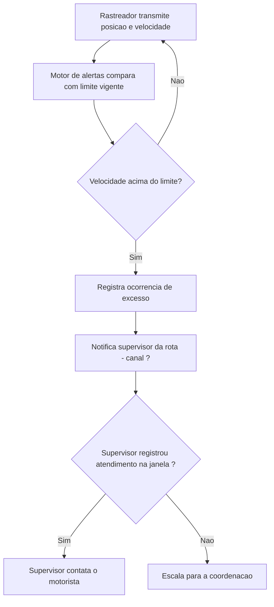
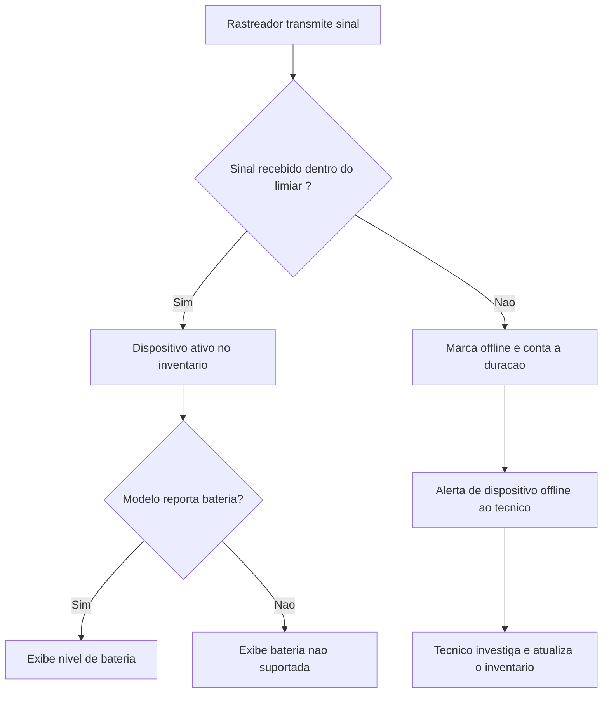
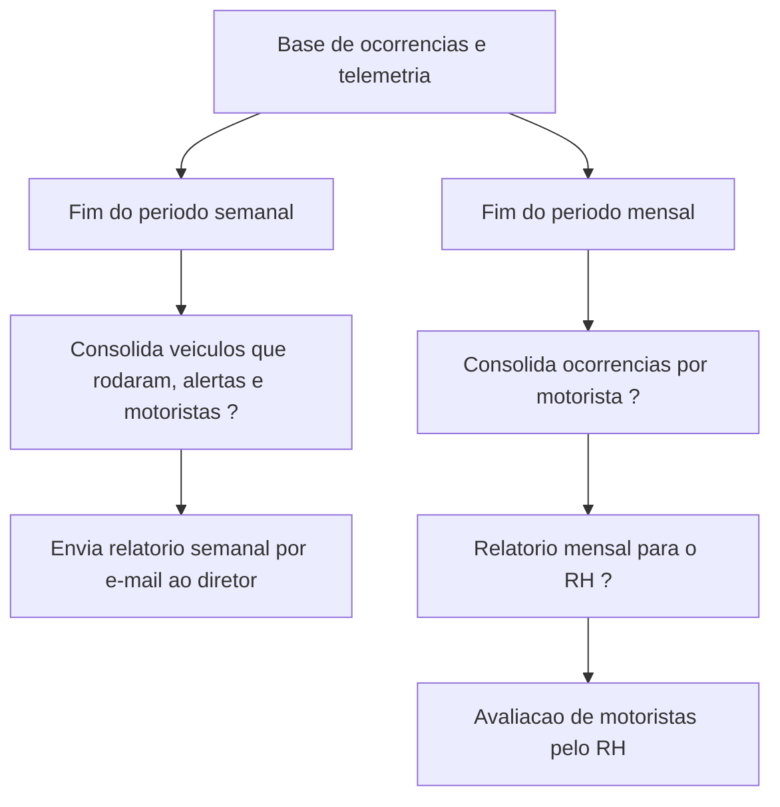
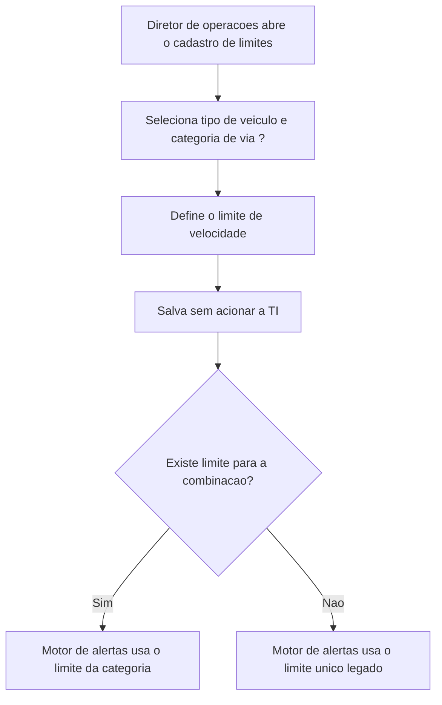
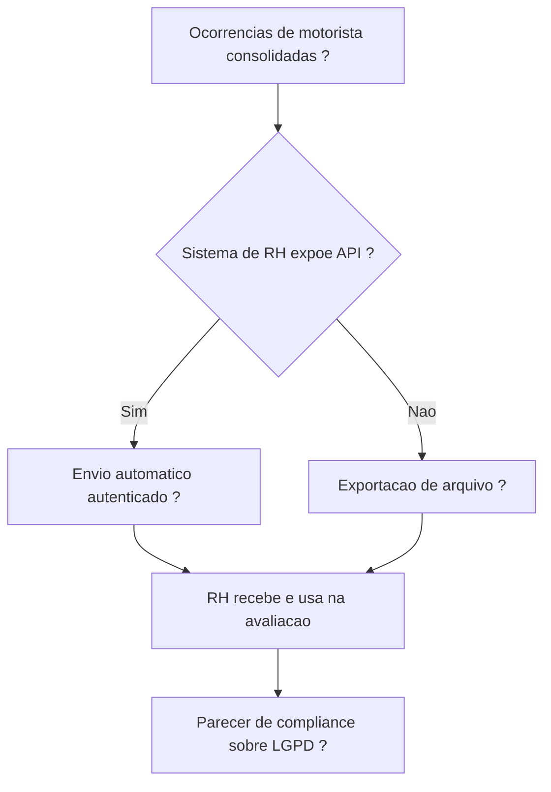
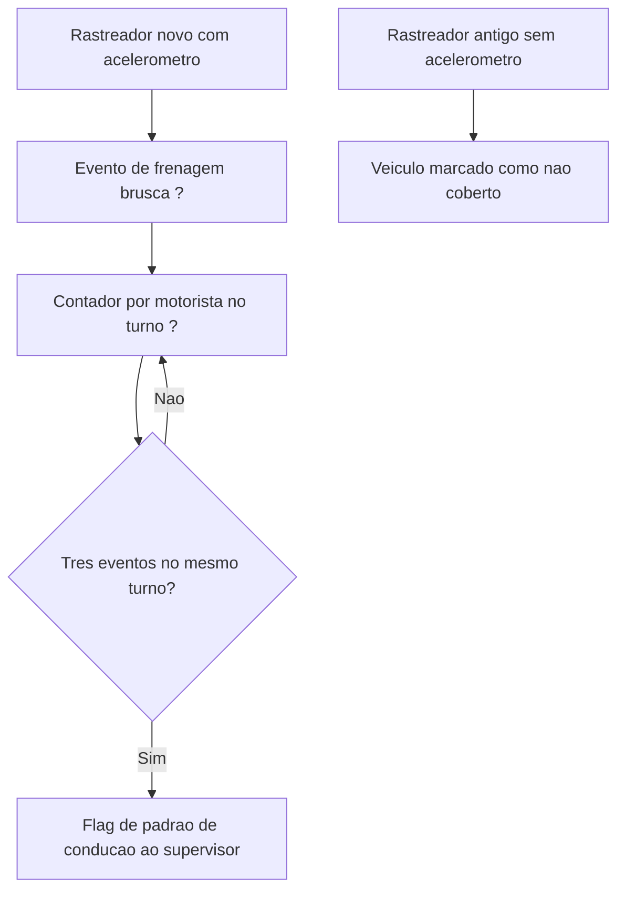
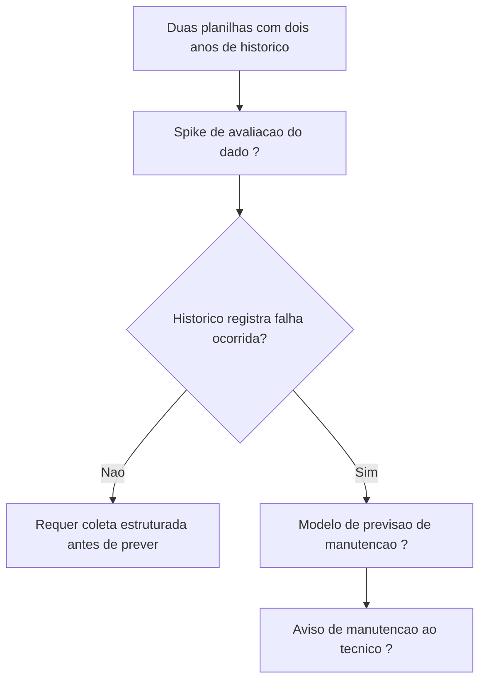
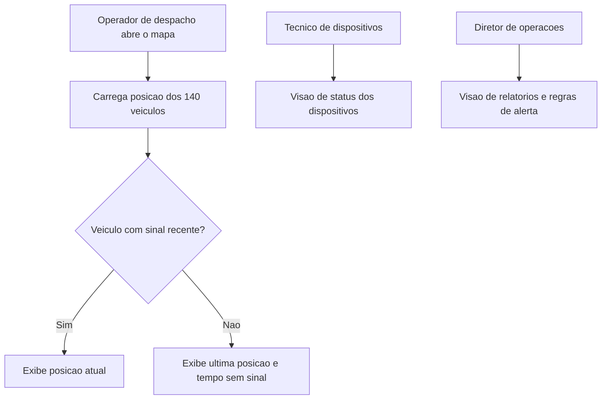

### 1. MAPA DE DOMÍNIOS

| # | Domínio | Descrição | Confiança |
|---|---|---|---|
| D1 | Monitoramento e Alertas de Frota | Detecção automática de excesso de velocidade em veículo em rota, com notificação e escalação hierárquica. | Alta |
| D2 | Gestão de Dispositivos GPS | Inventário e estado operacional dos rastreadores embarcados: ativo, offline, bateria, capacidade de sensor. | Alta |
| D3 | Analytics e Relatórios Gerenciais | Consolidação periódica de operação e ocorrências para consumo da diretoria e do RH. | Alta |
| D4 | Configuração de Regras de Negócio | Parametrização dos limites de velocidade por tipo de veículo e categoria de via, operada sem TI. | Média — os critérios de categorização foram exemplificados, não fechados. |
| D5 | Integração com Gestão de Pessoas | Envio das ocorrências de motorista ao sistema de RH para avaliação de desempenho. | Baixa — nem a existência de API é conhecida por quem falou. |
| D6 | Telemetria de Comportamento de Condução | Uso do acelerômetro para caracterizar padrão de condução de risco (frenagem brusca). | Média — a regra de negócio é precisa, o dado-fonte e o release não. |
| D7 | Manutenção Preditiva | Previsão de necessidade de manutenção a partir do histórico de uso dos veículos. | Baixa — declarado fora do primeiro release, com dado histórico não padronizado. |
| D8 | Privacidade e Compliance | Tratamento de dados de localização e de comportamento de motorista sob LGPD. | Baixa — levantado como pergunta em aberto pelo próprio stakeholder, sem resposta na sala. |

Domínios com confiança Baixa (D5, D7, D8) exigem uma segunda conversa de discovery — e, nos três casos, **com pessoas que não estavam nesta reunião**: RH, técnico de manutenção e jurídico/compliance.

---

### 2. MAPA DE STAKEHOLDERS

**Carlos Mendonça — Diretor de Operações**
- Tipo: negócio + usuário final (declara-se usuário do sistema: *"E eu. Três perfis diferentes."*)
- Requisitos que defende: alerta de velocidade em tempo real com escalação; monitoramento de status dos dispositivos GPS; dashboard gerencial automático; limites de alerta configuráveis sem TI; manutenção preditiva em fase posterior.
- Fronteira de autoridade: é a fonte de requisito de negócio, mas declarou explicitamente não ter três respostas — o número da latência (*"Não sei te dizer um número exato"*), a API do RH (*"Não tenho a menor ideia"*) e a posição jurídica sobre LGPD (*"Não sei a resposta"*). Essas três perguntas mudam de dono na Seção 5.

**Priya — TI/Infra**
- Tipo: técnico
- Requisitos que defende: nenhum requisito funcional próprio. Atua levantando restrição e risco — pergunta sobre inventário existente, sobre API do RH, sobre histórico de manutenção, e assume duas ações: levantar custo e prazo de instalação com o fornecedor de rastreadores (*"Tem contrato vigente, deve ser mais rápido"*) e envolver compliance na questão de LGPD.
- Contribuição classificada como **restrição técnica**, não requisito de negócio: a existência de contrato vigente com fornecedor e a necessidade de parecer jurídico condicionam o *como*, não o *o quê*.

**Marcus — consultor externo**
- Tipo: técnico (facilitador de discovery)
- Requisitos que defende: nenhum próprio. Produz o fechamento de escopo da reunião (*"Alertas de velocidade em tempo real com escalação. Monitoramento de status dos dispositivos GPS incluindo bateria e acelerômetro. Dashboard gerencial automático. Exportação de ocorrências pro sistema de RH. Manutenção preditiva como fase dois."*), confirmado por Carlos com *"Isso."*

**[VALIDAR COM EQUIPE] — divergência de classificação sobre frenagem brusca**
Carlos deixa o release em aberto duas vezes (*"não sei se isso entra agora ou depois"* / *"não sei se é primeira versão ou segunda"*). Priya fecha unilateralmente: *"Anoto como requisito futuro candidato."* Não é conflito de posições — é uma decisão de escopo tomada por quem não a detém, e que ninguém contestou na sala. Precisa voltar a Carlos e ao diretor antes de sair do backlog (P12).

**Stakeholders citados que não estavam na reunião** — nenhum requisito atribuído a eles pode ser considerado confirmado:
- **Diretor (superior de Carlos)** — negócio. Consome o relatório semanal e define o conteúdo da apresentação ao board de julho. Todo o conteúdo do relatório chega ao backlog em segunda mão.
- **RH** — negócio. Único autor do requisito de exportação de ocorrências. [VALIDAR COM EQUIPE]
- **Supervisor de rota e coordenação** — usuário final. São os destinatários do alerta e da escalação, e nenhum dos dois falou.
- **Operador de despacho e técnico de dispositivos** — usuário final. Perfis nomeados por Carlos, sem representação própria.
- **Jurídico/compliance** — restrição regulatória, ainda não consultado.
- **Fornecedor de rastreadores** — restrição técnica e comercial.

Nenhum **[CONFLITO]** de posições entre stakeholders presentes foi identificado no input. O risco desta transcrição não é divergência — é **unanimidade de uma fonte só**: cinco dos oito domínios vêm de um único emissor.

---

### 3. ESTRUTURA DE ÉPICOS

**E1 — Alertas de Velocidade em Tempo Real com Escalação**
- Descrição: detectar excesso de velocidade em veículo em rota e levar o evento ao supervisor responsável, escalando quando não houver tratamento.
- Complexidade: **G** — o esforço é dominado pela latência-alvo ainda indefinida, que decide entre arquitetura de polling e de streaming de eventos.
- Domínio: D1

**E2 — Monitoramento e Inventário de Dispositivos GPS**
- Descrição: manter o estado de cada rastreador (ativo, offline com duração, bateria) e alertar perda de sinal prolongada.
- Complexidade: **M** — regra de negócio simples sobre telemetria já existente, com uma inconsistência de hardware a acomodar.
- Domínio: D2
- [ANTI-PADRÃO: REQUISITO DUPLO] — *"A gente precisa saber quando o dispositivo ficou offline e por quanto tempo. Se ficou offline além de um certo tempo, vira um alerta diferente do de velocidade."* junta consulta de inventário e emissão de alerta. Decomposto em US-03 (alerta) e US-04 (inventário).

**E3 — Relatórios Gerenciais Automáticos**
- Descrição: substituir a consolidação manual em Excel por geração e envio automáticos, semanal para a diretoria e mensal para o RH.
- Complexidade: **M** — as métricas estão nomeadas; o esforço está na definição operacional de cada uma e na origem dos dados.
- Domínio: D3

**E4 — Parametrização de Regras de Alerta**
- Descrição: permitir que o limite de velocidade seja definido por tipo de veículo e categoria de via e alterado pela operação, sem chamado à TI.
- Complexidade: **M** — CRUD parametrizado, com o risco concentrado na lista de categorias, que está aberta.
- Domínio: D4
- [ANTI-PADRÃO: ESCOPO IMPLICITAMENTE INFINITO] — *"Caminhão pesado tem limite diferente de van leve. Em estrada tem limite diferente de perímetro urbano."* são exemplos, não uma lista fechada de categorias.

**E5 — Integração de Ocorrências com o Sistema de RH**
- Descrição: entregar as ocorrências de motorista ao sistema de gestão de pessoas para uso em avaliação.
- Complexidade: **[AMBIGUIDADE] M a G** — a faixa não é imprecisão de estimativa, é desconhecimento de método: exportação de arquivo e integração autenticada com sistema de terceiro diferem em uma ordem de magnitude. Fecha com a resposta de P9.
- Domínio: D5
- [ANTI-PADRÃO: VOZ PASSIVA SEM SUJEITO] — *"eles vão querer que as ocorrências de motorista sejam exportadas pra lá"*: não há ator declarado para a exportação.

**E6 — Telemetria de Comportamento de Condução**
- Descrição: usar o acelerômetro dos rastreadores novos para sinalizar padrão de frenagem brusca ao supervisor.
- Complexidade: **M** — a regra de contagem é precisa; o formato do dado-fonte e o limiar físico não existem.
- Domínio: D6
- [ANTI-PADRÃO: DEPENDÊNCIA CIRCULAR] — a cobertura do épico depende da compra de rastreadores novos (*"eu vou precisar levantar cotação de novos rastreadores pra substituir os modelos antigos que não têm esse sensor"*), e a justificativa da compra depende de o épico entrar em escopo (*"não sei se é primeira versão ou segunda"*). Pré-requisito real: a decisão de escopo (P12), não a compra — o épico é entregável na frota que já tem o sensor (*"Mas o acelerômetro já está lá no hardware"*).

**E7 — Manutenção Preditiva**
- Descrição: prever a necessidade de manutenção de um veículo a partir do histórico de uso.
- Complexidade: **GG** — modelagem preditiva sobre dois anos de dado não padronizado, sem métrica de sucesso declarada.
- Domínio: D7
- Escopo declarado para fase dois pelo próprio stakeholder: *"Não precisa ser no primeiro release."*

**E8 — Visão Operacional em Mapa e Perfis de Acesso**
- Descrição: entregar a cada um dos três perfis a visão de que ele precisa, sendo o mapa ao vivo da frota a visão do operador de despacho.
- Complexidade: **G** — renderização contínua de 140 veículos e segregação de três visões distintas.
- Domínio: D1 / D2 / D3 (transversal)

---

### 4. USER STORIES

---

#### US-01 — Alerta automático de excesso de velocidade
**Épico:** E1 · **Feature:** Motor de alertas de velocidade

**a. Card**
Como **supervisor de rota**, quero **ser notificado automaticamente quando um veículo sob minha responsabilidade exceder o limite de velocidade vigente**, para que **eu possa contatar o motorista durante a infração, e não depois da multa**.

**b. Validação INVEST**
- **Independent** — [INVEST-COND: Independent] · Depende do limite parametrizado de US-08. Condição: *implementar contra o limite único do legado como default e plugar a parametrização quando US-08 entrar.* Removível pelo time, com base no legado descrito (*"Hoje a gente usa um limite único pra tudo"*).
- **Negotiable** — PASS · O canal, o formato e a agregação do alerta são negociáveis sem perder o núcleo do requisito.
- **Valuable** — PASS · Valor declarado em dois efeitos concretos: multa evitável e acidente.
- **Estimable** — [INVEST-COND: Estimable] · A latência-alvo não existe, mas existe um teto declarado. Condição: *estimar contra o teto ancorado de cinco minutos e tratar latência sub-minuto como escopo separado, dependente de P1.*
- **Small** — PASS · Detecção sobre telemetria já recebida mais notificação de um destinatário.
- **Testable** — PASS · Com a condição de Estimable fixada, o critério é numérico e automatizável.

**c. Critérios de aceite (Gherkin)**

```gherkin
Cenário: Excesso de velocidade gera alerta ao supervisor dentro do teto declarado
  Dado que um veículo da frota está em rota com rastreador transmitindo
  E que o limite de velocidade vigente para esse veículo está configurado
  Quando a velocidade transmitida ultrapassar o limite vigente
  Então o sistema registra uma ocorrência de excesso de velocidade com veículo, motorista, velocidade e horário
  E notifica o supervisor da rota em menos de 5 minutos a partir da transmissão
```
> âncora: "Tem que ser em tempo real. Não pode ter delay de cinco minutos." + "Pro supervisor direto da rota."

```gherkin
Cenário: Ocorrência fora do horário em que há operador na tela
  Dado que nenhum operador de despacho está com o painel aberto
  Quando um veículo ultrapassar o limite de velocidade vigente
  Então o sistema registra a ocorrência e notifica o supervisor da rota
  E o registro não depende de nenhuma ação humana prévia
```
> âncora: "Só que tem turno, tem almoço, às vezes a coisa acontece e ninguém viu."

```gherkin
Cenário: Veículo sem sinal não produz alerta de velocidade
  Dado que um veículo está sem transmitir telemetria há mais que o limiar de offline
  Quando o período sem sinal se encerrar
  Então o sistema não emite alerta de excesso de velocidade referente ao intervalo sem dado
  E a ausência é tratada pelo fluxo de dispositivo offline de US-03
```
> âncora: "Às vezes o caminhão some do mapa por vinte minutos e a gente não sabe se é o dispositivo que morreu, se é área sem cobertura."

**d. Dependências**
- US-08 (limites por categoria) — mitigável pelo default do legado.
- Cadastro de associação veículo → rota → supervisor: não existe em nenhum sistema hoje (*"Hoje isso não existe, é tudo boca a boca"*). Bloqueio real de dados, ver P4.
- Telemetria de velocidade dos rastreadores: origem existente, contrato de dados não confirmado.

**e. Notas técnicas**
- A escolha entre polling do legado e ingestão de eventos é consequência direta de P1 e precisa ser decidida pelo time de arquitetura antes do comprometimento de sprint.
- O sistema de 2016 *"não tem API documentada"* segundo o contexto de projeto; a origem da telemetria em produção não foi discutida na reunião.
- [ANTI-PADRÃO: RESULTADO NÃO VERIFICÁVEL] em *"Mas rápido."* — nenhum número foi derivado a partir disso.

**f. Candidatos derivados**
- Notificação automática ao próprio motorista no veículo — [GOLD PLATING]. A âncora *"a gente poderia ter evitado se tivesse avisado o motorista na hora"* sustenta o **objetivo**, mas o único mecanismo descrito é humano: *"talvez o supervisor tivesse ligado antes"*. Notificação direta ao motorista é sistema novo, não pedido.
- Deduplicação e janela de silêncio para excessos consecutivos do mesmo veículo — [GOLD PLATING]. Boa prática de operação de alertas, sem qualquer menção no input.
- Alerta de saída de rota — [GOLD PLATING]. A expressão *"pra ver se algum veículo saiu da rota ou tá com velocidade alta"* descreve a vigilância manual de hoje; Carlos priorizou apenas velocidade quando Marcus perguntou. Promover exige decisão humana.

---

#### US-02 — Escalação de alerta não atendido
**Épico:** E1 · **Feature:** Escalação de alertas

**a. Card**
Como **coordenação de operações**, quero **receber automaticamente os alertas de velocidade que o supervisor da rota não atendeu dentro da janela definida**, para que **nenhuma ocorrência fique sem tratamento por indisponibilidade do supervisor**.

**b. Validação INVEST**
- **Independent** — [INVEST-COND: Independent] · Depende do evento produzido por US-01. Condição: *desenvolver contra um evento de alerta mockado, com o contrato de evento fixado antes.*
- **Negotiable** — PASS · Número de níveis e destinatários da escalação são negociáveis.
- **Valuable** — PASS · Substitui um processo que hoje não existe.
- **Estimable** — PASS · O valor da janela é parâmetro; o esforço de um temporizador com escalação não varia com ele.
- **Small** — PASS.
- **Testable** — [INVEST-FAIL: Testable] · O critério "não atendeu" não tem definição possível: não há ato de atendimento no sistema nem no processo atual — *"Hoje isso não existe, é tudo boca a boca"* remove inclusive a saída de herdar o comportamento do legado. Quem define o que constitui atendimento e a janela em minutos é a coordenação de operações, não o time. Destrava com **P3**.

**c. Critérios de aceite (Gherkin)**

```gherkin
Cenário: Alerta sem atendimento é escalado para a coordenação
  Dado um alerta de excesso de velocidade notificado ao supervisor da rota
  E que o supervisor não registrou atendimento
  Quando decorrer a janela de [A CONFIRMAR COM STAKEHOLDER] minutos desde a notificação
  Então o sistema notifica a coordenação com o alerta original e o tempo decorrido
  E marca o alerta como escalado
```
> âncora: "Se o supervisor não atender em uns minutos, escala pra coordenação."

```gherkin
Cenário: Atendimento dentro da janela impede a escalação
  Dado um alerta de excesso de velocidade notificado ao supervisor da rota
  Quando o supervisor registrar atendimento antes de decorrida a janela de [A CONFIRMAR COM STAKEHOLDER] minutos
  Então o sistema não notifica a coordenação
  E o alerta fica com estado atendido e o horário do atendimento
```
> âncora: "Se o supervisor não atender em uns minutos, escala pra coordenação."

**d. Dependências**
- US-01 (evento de alerta).
- Cadastro de coordenação e da cadeia rota → supervisor → coordenação. Inexistente hoje.

**e. Notas técnicas**
- A janela precisa ser parâmetro de sistema, não constante, porque o valor chegará depois do desenvolvimento.
- [ANTI-PADRÃO: RESULTADO NÃO VERIFICÁVEL] em *"Se o supervisor não atender em uns minutos"* — duas indefinições em uma frase: o verbo e o número.

**f. Candidatos derivados**
- Segundo nível de escalação para a diretoria após a coordenação — [GOLD PLATING]. A cadeia descrita tem exatamente dois degraus.
- Registro de justificativa do supervisor ao atender — [GOLD PLATING]. Nada no input pede motivo, apenas atendimento.

---

#### US-03 — Alerta de dispositivo offline
**Épico:** E2 · **Feature:** Detecção de perda de sinal

**a. Card**
Como **técnico de dispositivos**, quero **ser alertado quando um rastreador ficar sem transmitir além do tempo tolerado, com a duração da ausência**, para que **nenhum veículo permaneça sem monitoramento sem que alguém saiba**.

**b. Validação INVEST**
- **Independent** — PASS · Consome a mesma telemetria de US-01, mas nenhuma das duas bloqueia a outra.
- **Negotiable** — PASS.
- **Valuable** — PASS · Hoje a ausência de sinal só é percebida por quem estiver olhando o mapa.
- **Estimable** — PASS · Detecção de ausência de heartbeat com contador de duração; escopo estável independentemente do limiar escolhido.
- **Small** — PASS.
- **Testable** — [INVEST-COND: Testable] · Falta o limiar de tempo. Condição: *parametrizar o limiar de offline e escrever o teste contra o valor de parâmetro, confirmando o número com o diretor de operações em P6.*

**c. Critérios de aceite (Gherkin)**

```gherkin
Cenário: Ausência de sinal além do limiar gera alerta ao técnico
  Dado um veículo cujo rastreador transmitia normalmente
  Quando o rastreador deixar de transmitir por mais que o limiar configurado de [A CONFIRMAR COM STAKEHOLDER] minutos
  Então o sistema marca o dispositivo como offline
  E notifica o técnico de dispositivos com o identificador do veículo e a duração da ausência
```
> âncora: "A gente precisa saber quando o dispositivo ficou offline e por quanto tempo."

```gherkin
Cenário: Alerta de offline é distinto do alerta de velocidade
  Dado um dispositivo marcado como offline além do limiar configurado
  Quando o sistema emitir a notificação correspondente
  Então o alerta é do tipo dispositivo offline
  E não é contabilizado nem exibido como alerta de excesso de velocidade
```
> âncora: "Se ficou offline além de um certo tempo, vira um alerta diferente do de velocidade."

```gherkin
Cenário: Retorno de sinal antes do limiar não gera alerta
  Dado um veículo cujo rastreador parou de transmitir
  Quando a transmissão for retomada antes de decorrido o limiar configurado
  Então o sistema não emite alerta de dispositivo offline
  E registra o intervalo sem sinal com sua duração
```
> âncora: "Às vezes o caminhão some do mapa por vinte minutos e a gente não sabe se é o dispositivo que morreu, se é área sem cobertura."

**d. Dependências**
- Fluxo de telemetria dos rastreadores (mesma origem de US-01).

**e. Notas técnicas**
- A distinção entre falha de dispositivo e área sem cobertura é a **dor** relatada, não o requisito acordado. O requisito é saber que está offline e há quanto tempo. Qualquer inferência de causa está fora de escopo até que alguém peça.
- Mapa de cobertura de operadora não foi mencionado e não pode ser presumido.

**f. Candidatos derivados**
- Classificação automática da causa da perda de sinal (falha de hardware x área sem cobertura) — [GOLD PLATING]. É a dor citada, não o pedido; exigiria dado de cobertura que ninguém mencionou ter.
- Escalação do alerta de offline quando o técnico não age — [GOLD PLATING]. A escalação foi descrita apenas para o alerta de velocidade.

---

#### US-04 — Inventário de status dos dispositivos
**Épico:** E2 · **Feature:** Inventário de dispositivos

**a. Card**
Como **técnico de dispositivos**, quero **ver no dashboard o status atual de cada rastreador da frota — ativo, offline ou com bateria baixa**, para que **o controle deixe de depender de uma planilha atualizada por memória**.

**b. Validação INVEST**
- **Independent** — [INVEST-COND: Independent] · A coluna de status offline usa a mesma regra de US-03. Condição: *consumir o estado de offline atrás de uma interface, com implementação mockada até US-03 entrar.*
- **Negotiable** — PASS · Colunas, ordenação e filtros são negociáveis.
- **Valuable** — PASS · Substitui a planilha atualizada *"quando lembra"*.
- **Estimable** — PASS · Listagem sobre estado já calculado; a inconsistência de hardware é tratada como estado adicional, não como esforço variável.
- **Small** — PASS · 140 registros, sem paginação complexa.
- **Testable** — [INVEST-COND: Testable] · Falta o limiar de bateria baixa. Condição: *parametrizar o limiar de bateria e testar contra o parâmetro, confirmando o valor com o técnico e o fornecedor em P14.*

**c. Critérios de aceite (Gherkin)**

```gherkin
Cenário: Técnico consulta o status de toda a frota
  Dado que os 140 veículos possuem rastreador cadastrado
  Quando o técnico de dispositivos abrir o inventário de dispositivos
  Então o sistema exibe uma linha por dispositivo com o estado ativo ou offline
  E exibe o nível de bateria para os dispositivos que o reportam
```
> âncora: "O dashboard novo precisa ter isso: qual dispositivo está ativo, qual está offline, qual está com bateria baixa."

```gherkin
Cenário: Dispositivo antigo que não reporta bateria
  Dado um dispositivo do modelo antigo, que não transmite nível de bateria
  Quando o técnico de dispositivos abrir o inventário de dispositivos
  Então a coluna de bateria desse dispositivo apresenta o estado não suportado
  E esse dispositivo nunca é classificado como bateria baixa
```
> âncora: "os dispositivos novos mandam nível de bateria via sinal. Os mais antigos não. Tem essa inconsistência."

**d. Dependências**
- US-03 (cálculo de offline).
- Carga inicial do cadastro: hoje o dado vive em planilha Excel de atualização irregular — a qualidade da carga não foi discutida.

**e. Notas técnicas**
- É necessário um atributo de capacidade por modelo de dispositivo (reporta bateria? tem acelerômetro?), que hoje não existe em lugar nenhum. Ele também é pré-requisito de US-09.
- A migração da planilha para o cadastro é trabalho não mencionado na reunião e não estimado aqui.

**f. Candidatos derivados**
- Histórico de trocas, instalações e retiradas de dispositivo — [GOLD PLATING]. Inventário de estado atual é o que foi pedido.
- Abertura automática de ordem de serviço para o técnico — [GOLD PLATING]. Nenhum processo de manutenção de dispositivo foi descrito.

---

#### US-05 — Relatório semanal automático de operação
**Épico:** E3 · **Feature:** Relatório semanal de operação

**a. Card**
Como **diretor de operações**, quero **que o relatório semanal com veículos que rodaram, alertas gerados e motoristas com mais ocorrências seja gerado e enviado automaticamente ao meu diretor**, para que **eu deixe de gastar duas horas por semana consolidando exportações no Excel**.

**b. Validação INVEST**
- **Independent** — [INVEST-COND: Independent] · A métrica de alertas depende de US-01 existir. Condição: *desenvolver o motor de relatório contra a base de ocorrências, alimentada por dados de teste até US-01 produzir os reais.*
- **Negotiable** — PASS · Layout e canal são negociáveis; o conjunto de três métricas é o núcleo.
- **Valuable** — PASS · Valor quantificado pelo próprio stakeholder: duas horas semanais.
- **Estimable** — PASS · Três agregações e um envio por e-mail, canal já em uso hoje.
- **Small** — PASS.
- **Testable** — [INVEST-COND: Testable] · "Veículo que rodou" não tem definição operacional. Condição: *fixar a definição em ao menos um registro de telemetria em movimento no período e submetê-la à validação do diretor em P8, ajustando o teste se ele divergir.*

**c. Critérios de aceite (Gherkin)**

```gherkin
Cenário: Relatório semanal é gerado e enviado sem intervenção manual
  Dado que o período semanal configurado se encerrou
  E que existem registros de operação e de alertas no período
  Quando o sistema executar a geração do relatório semanal
  Então o relatório contém a quantidade de veículos que rodaram, a quantidade de alertas gerados e a lista de motoristas ordenada por número de ocorrências
  E é enviado por e-mail ao diretor sem nenhuma ação de um operador
```
> âncora: "Meu diretor me pede toda semana: quantos veículos rodaram, quantos alertas foram gerados, qual motorista teve mais ocorrências." + "Hoje eu faço isso na mão, exporto do sistema, jogo no Excel, mando por e-mail."

```gherkin
Cenário: Semana sem nenhum alerta registrado
  Dado que o período semanal configurado se encerrou
  E que nenhum alerta foi gerado no período
  Quando o sistema executar a geração do relatório semanal
  Então o relatório é enviado com a quantidade de alertas igual a zero
  E não é suprimido nem substituído por ausência de dados
```
> âncora: "quantos alertas foram gerados"

**d. Dependências**
- US-01 e US-03 como fontes das ocorrências contabilizadas.
- Serviço de envio de e-mail: hoje o envio é feito pelo próprio Carlos, não há infraestrutura de disparo automático confirmada.

**e. Notas técnicas**
- [ANTI-PADRÃO: VOZ PASSIVA SEM SUJEITO] em *"Tem que ser automático."* — não há ator nem gatilho declarado; a interpretação adotada é execução agendada pelo sistema ao fim do período, e ela precisa de confirmação.
- O destinatário final do relatório é o superior de Carlos, que não estava na reunião. O conteúdo chegou em segunda mão.

**f. Candidatos derivados**
- Regra de desempate na lista de motoristas com mais ocorrências — [GOLD PLATING]. Nenhum critério de desempate foi mencionado.
- Comparação com a semana anterior, tendência ou gráfico — [GOLD PLATING]. Nada no input pede série histórica.
- Portal para o diretor consultar o relatório sob demanda — [GOLD PLATING]. O mecanismo descrito é envio, não consulta.

---

#### US-06 — Relatório mensal de ocorrências por motorista para o RH
**Épico:** E3 · **Feature:** Relatório mensal de ocorrências

**a. Card**
Como **analista de RH**, quero **receber mensalmente as ocorrências consolidadas por motorista**, para que **eu as utilize na avaliação de desempenho dos motoristas**.

**b. Validação INVEST**
- **Independent** — [INVEST-COND: Independent] · Reaproveita o motor de US-05. Condição: *implementar a periodicidade mensal como configuração do mesmo motor de relatórios.*
- **Negotiable** — PASS.
- **Valuable** — PASS · Uso declarado: avaliação de motoristas.
- **Estimable** — PASS · Como entrega de relatório — separada da integração, que é US-07 — o esforço é conhecido.
- **Small** — PASS.
- **Testable** — [INVEST-FAIL: Testable] · Não existe definição de "ocorrência de motorista". Excesso de velocidade, frenagem brusca e dispositivo offline são candidatos com consequências diferentes para o avaliado, e offline sequer é falha do motorista. A definição pertence ao RH, que não estava na reunião e cujo uso do dado é avaliativo. Destrava com **P10**.

**c. Critérios de aceite (Gherkin)**

```gherkin
Cenário: Consolidação mensal por motorista
  Dado que o período mensal configurado se encerrou
  E que existem ocorrências registradas no período
  Quando o sistema executar a geração do relatório mensal
  Então o relatório apresenta uma linha por motorista com a contagem de ocorrências dos tipos definidos em P10
  E cobre exatamente o intervalo do mês encerrado
```
> âncora: "Mensal pro RH, porque o RH usa isso pra avaliação de motoristas."

```gherkin
Cenário: Motorista sem nenhuma ocorrência no mês
  Dado que o período mensal configurado se encerrou
  E que um motorista ativo não registrou nenhuma ocorrência
  Quando o sistema executar a geração do relatório mensal
  Então esse motorista aparece no relatório com contagem zero
  E não é omitido da consolidação
```
> âncora: "qual motorista teve mais ocorrências"

**d. Dependências**
- US-01, US-03 e possivelmente US-09 como fontes de ocorrência — o conjunto depende de P10.
- Cadastro de motoristas e vínculo motorista → viagem → veículo: não foi mencionado que exista.
- Parecer de compliance sobre uso de dado de comportamento em avaliação de desempenho (P11).

**e. Notas técnicas**
- Este relatório é o ponto de contato entre telemetria e consequência trabalhista. É o item de maior exposição LGPD do backlog e não deve ir a produção antes de P11.
- O vínculo motorista-veículo é pressuposto por toda a métrica "por motorista" e nunca foi confirmado como dado disponível.

**f. Candidatos derivados**
- Ranking ou nota de desempenho por motorista — [GOLD PLATING]. O input pede ocorrências; pontuação é interpretação nossa com efeito sobre pessoas.
- Notificação ao motorista sobre suas próprias ocorrências — [GOLD PLATING]. Não mencionado, ainda que provavelmente relevante para LGPD.

---

#### US-07 — Entrega das ocorrências ao sistema de RH
**Épico:** E5 · **Feature:** Integração com gestão de pessoas

**a. Card**
Como **analista de RH**, quero **que as ocorrências de motorista cheguem ao sistema de gestão de pessoas**, para que **a avaliação seja feita sem redigitação dos dados**.

**b. Validação INVEST**
- **Independent** — [INVEST-FAIL: Independent] · Depende integralmente de um sistema de terceiro cujo nome sequer consta na transcrição e cujas capacidades ninguém na sala conhece. Destrava com **P9**.
- **Negotiable** — PASS · O próprio stakeholder colocou o escopo em aberto: *"Não sei se é integração automática ou exportação manual"*.
- **Valuable** — PASS.
- **Estimable** — [INVEST-FAIL: Estimable] · A diferença entre gerar um arquivo e integrar com autenticação, mapeamento e tratamento de erro em sistema de terceiro é de ordem de magnitude. Destrava com **P9**.
- **Small** — [INVEST-FAIL: Small] · Não é possível afirmar que cabe em um sprint sem conhecer o método de entrega.
- **Testable** — [INVEST-FAIL: Testable] · Sem contrato de dados nem definição de ocorrência (P10), não há asserção possível.

**c. Critérios de aceite (Gherkin)**

```gherkin
Cenário: Ocorrências do período são entregues ao sistema de RH
  Dado que o relatório mensal de ocorrências por motorista foi consolidado
  E que o método de entrega definido em P9 está configurado
  Quando o sistema executar a entrega do período
  Então o conjunto de ocorrências do período é entregue integralmente ao sistema de RH
  E o sistema registra a confirmação de recebimento com data e quantidade de registros
```
> âncora: "eles vão querer que as ocorrências de motorista sejam exportadas pra lá."

```gherkin
Cenário: Falha na entrega ao sistema de RH
  Dado que uma entrega de ocorrências foi iniciada
  Quando o sistema de RH não confirmar o recebimento
  Então o sistema mantém o período como não entregue
  E notifica o responsável pela integração sem descartar os registros
```
> âncora: "A gente verifica com o RH antes de definir o tipo de integração."

**d. Dependências**
- US-06 (dataset consolidado).
- Sistema de gestão de pessoas do RH: existência de API, autenticação, formato e SLA — todos desconhecidos.
- Parecer de compliance (P11) sobre transferência de dado de localização e comportamento entre sistemas.

**e. Notas técnicas**
- O nome do sistema de RH não foi transcrito por decisão da empresa. Não deve ser inferido nem preenchido em nenhum artefato até que o RH o informe.
- Direção da integração nunca foi discutida: só saída de ocorrências, ou também entrada do cadastro de motoristas do RH? A segunda hipótese resolveria a dependência de cadastro de US-06 e mudaria o desenho.

**f. Candidatos derivados**
- Sincronização bidirecional com o cadastro de pessoas do RH — [GOLD PLATING]. Faz sentido técnico e não foi pedido.
- Reprocessamento e reenvio automático de períodos anteriores — [GOLD PLATING].

---

#### US-08 — Configuração de limites de velocidade por categoria
**Épico:** E4 · **Feature:** Cadastro de limites por categoria

**a. Card**
Como **diretor de operações**, quero **definir o limite de velocidade por tipo de veículo e por categoria de via e alterá-lo eu mesmo**, para que **uma mudança de limite não dependa de abrir chamado para a TI**.

**b. Validação INVEST**
- **Independent** — PASS · É o cadastro que US-01 consome; não é bloqueada por nenhuma outra história.
- **Negotiable** — PASS.
- **Valuable** — PASS · Elimina o acionamento da TI e o limite único herdado da limitação do sistema atual.
- **Estimable** — [INVEST-COND: Estimable] · A lista de categorias está aberta. Condição: *implementar como cadastro genérico de combinações tipo de veículo × categoria de via e carregar apenas as quatro categorias citadas, deixando a lista final para P7.*
- **Small** — PASS.
- **Testable** — PASS · A verificação é qual limite o motor de alertas aplicou, e é determinística.

**c. Critérios de aceite (Gherkin)**

```gherkin
Cenário: Alteração de limite pela operação, sem TI
  Dado que existe um limite cadastrado para a combinação de tipo de veículo e categoria de via
  Quando o diretor de operações alterar o valor desse limite pela interface e salvar
  Então o novo valor passa a ser o limite vigente para essa combinação
  E a alteração é concluída sem nenhuma intervenção da equipe de TI
```
> âncora: "precisa ser fácil de mudar, sem precisar de TI toda vez que o DETRAN muda o limite da rodovia."

```gherkin
Cenário: Limite diferenciado por tipo de veículo na mesma via
  Dado dois veículos de tipos diferentes trafegando na mesma categoria de via
  Quando o motor de alertas avaliar a velocidade de cada um
  Então cada veículo é avaliado contra o limite cadastrado para o seu tipo
  E um deles pode gerar alerta enquanto o outro, na mesma velocidade, não gera
```
> âncora: "Caminhão pesado tem limite diferente de van leve. Em estrada tem limite diferente de perímetro urbano."

```gherkin
Cenário: Combinação sem limite cadastrado
  Dado um veículo cuja combinação de tipo e categoria de via não possui limite cadastrado
  Quando o motor de alertas avaliar a velocidade desse veículo
  Então a avaliação usa o limite único herdado do sistema atual
  E o sistema registra que o limite aplicado foi o default
```
> âncora: "Hoje a gente usa um limite único pra tudo porque o sistema não suporta outra coisa."

**d. Dependências**
- Classificação de cada veículo da frota por tipo: não foi confirmado que esse dado exista hoje.
- Determinação da categoria da via em que o veículo trafega: nenhuma fonte foi mencionada na reunião. Dependência não declarada, ver Seção 8.

**e. Notas técnicas**
- A regra por via só é executável se o sistema souber em que tipo de via o veículo está. Isso exige mapa viário com classificação ou georreferenciamento de rota, e nada disso apareceu no input. É a maior lacuna silenciosa do épico E4.
- *"As regras de alerta são configuráveis?"* foi respondido apenas para velocidade. Se "regras" abranger também offline e frenagem brusca, o cadastro muda de forma.

**f. Candidatos derivados**
- Histórico de versões e auditoria de quem alterou cada limite — [GOLD PLATING]. Razoável para um parâmetro com efeito legal, e ausente do input.
- Tolerância percentual antes de disparar o alerta — [GOLD PLATING]. Prática comum em telemetria, nunca mencionada.
- Agendamento de vigência futura para um limite — [GOLD PLATING].

---

#### US-09 — Sinalização de padrão de frenagem brusca
**Épico:** E6 · **Feature:** Detecção de comportamento de risco

**a. Card**
Como **supervisor de rota**, quero **ser sinalizado quando um motorista acumular três eventos de frenagem brusca no mesmo turno**, para que **eu trate o padrão de condução antes que ele resulte em acidente**.

**b. Validação INVEST**
- **Independent** — [INVEST-COND: Independent] · A cobertura depende da troca de rastreadores antigos. Condição: *limitar o escopo aos veículos que já possuem acelerômetro embarcado e tratar a frota antiga como não coberta.* Sustentada por *"Mas o acelerômetro já está lá no hardware"*.
- **Negotiable** — PASS.
- **Valuable** — PASS · Vinculado pelo stakeholder ao mesmo risco do excesso de velocidade.
- **Estimable** — [INVEST-FAIL: Estimable] · Não se sabe o que o rastreador entrega: leitura bruta de acelerômetro em alta frequência ou evento de frenagem já processado no dispositivo. As duas hipóteses diferem em pipeline de ingestão, volume e custo. Só o fornecedor responde. Destrava com **P15**.
- **Small** — PASS, sob a condição de Independent.
- **Testable** — [INVEST-FAIL: Testable] · Faltam duas definições que o time não pode arbitrar: o limiar físico que caracteriza frenagem brusca e o intervalo que define um turno. Inventar qualquer um dos dois é fabricar especificação com efeito sobre avaliação de motorista. Destrava com **P13**.

**c. Critérios de aceite (Gherkin)**

```gherkin
Cenário: Terceiro evento de frenagem brusca no turno gera flag
  Dado um motorista em turno conduzindo veículo com rastreador que possui acelerômetro
  E que dois eventos de frenagem brusca já foram registrados no turno
  Quando um terceiro evento de frenagem brusca for registrado no mesmo turno
  Então o sistema gera uma flag de padrão de condução para o supervisor da rota
  E a flag identifica o motorista, o veículo e os três eventos
```
> âncora: "Três eventos de frenagem brusca num turno, isso precisa virar uma flag pro supervisor."

```gherkin
Cenário: Veículo com rastreador antigo não é avaliado
  Dado um veículo cujo rastreador não possui acelerômetro
  Quando o veículo operar durante um turno completo
  Então o sistema não gera flag de frenagem brusca para esse veículo
  E o veículo consta como não coberto pela detecção de comportamento
```
> âncora: "os novos ainda têm acelerômetro" + "modelos antigos que não têm esse sensor"

**d. Dependências**
- Atributo de capacidade por modelo de dispositivo (também requisito de US-04).
- Definição de turno e vínculo motorista → turno → veículo: não confirmados como dado existente.
- Decisão de escopo entre primeiro release e fase dois (P12).

**e. Notas técnicas**
- [ANTI-PADRÃO: DEPENDÊNCIA CIRCULAR] entre esta história e a compra de rastreadores. Pré-requisito real é a decisão de escopo; a compra amplia cobertura, não viabiliza a história.
- [ANTI-PADRÃO: VOZ PASSIVA SEM SUJEITO] em *"isso precisa virar uma flag pro supervisor"* — quem gera, onde a flag aparece e o que o supervisor faz com ela não foram declarados.
- Se o rastreador entregar aceleração bruta, o volume de dados de 140 veículos muda a ordem de grandeza da ingestão. Decisão do time de arquitetura, após P15.

**f. Candidatos derivados**
- Detecção de aceleração brusca, curva agressiva ou outros eventos do mesmo sensor — [GOLD PLATING]. O input pede exatamente um evento.
- Score de condução por motorista — [GOLD PLATING]. Extrapola o pedido e tem consequência sobre pessoas.
- Inclusão da flag de frenagem no relatório do RH — [GOLD PLATING]. Só P10 pode autorizar.

---

#### US-10 — Mapa operacional ao vivo
**Épico:** E8 · **Feature:** Mapa operacional

**a. Card**
Como **operador de despacho**, quero **ver a posição atual dos veículos da frota em um mapa**, para que **eu acompanhe a operação sem depender da varredura manual da tela do sistema atual**.

**b. Validação INVEST**
- **Independent** — PASS · Consome telemetria; não é bloqueada pelas histórias de alerta.
- **Negotiable** — PASS.
- **Valuable** — PASS · É a visão declarada do perfil operador.
- **Estimable** — [INVEST-COND: Estimable] · A taxa de atualização não foi definida, mas, diferentemente de US-01, ela não decide arquitetura: o mapa é consultado com a tela aberta e a atualização pode ser um intervalo parametrizado. Condição: *implementar a atualização como intervalo configurável e estimar sobre esse desenho, ajustando o valor após P1.*
- **Small** — PASS · Posição atual, sem histórico de trajeto.
- **Testable** — [INVEST-COND: Testable] · Mesma condição de Estimable: testar contra o intervalo configurado.

**c. Critérios de aceite (Gherkin)**

```gherkin
Cenário: Operador acompanha a frota no mapa
  Dado que os 140 veículos possuem rastreador transmitindo
  Quando o operador de despacho abrir o mapa
  Então o sistema exibe a posição de cada veículo com sinal recente
  E atualiza as posições a cada intervalo configurado de [A CONFIRMAR COM STAKEHOLDER] segundos, sem recarregar a página
```
> âncora: "O operador precisa ver o mapa em tempo real." + "A gente tem cento e quarenta veículos"

```gherkin
Cenário: Veículo sem sinal no mapa
  Dado um veículo que parou de transmitir há mais que o limiar de offline
  Quando o operador de despacho abrir o mapa
  Então o veículo é exibido na última posição conhecida
  E o mapa apresenta o tempo decorrido desde a última transmissão
```
> âncora: "Às vezes o caminhão some do mapa por vinte minutos e a gente não sabe se é o dispositivo que morreu"

**d. Dependências**
- Fluxo de telemetria de posição.
- US-03 para o conceito de offline exibido no mapa.

**e. Notas técnicas**
- [ANTI-PADRÃO: RESULTADO NÃO VERIFICÁVEL] em *"O operador precisa ver o mapa em tempo real."* — o único teto numérico da transcrição, cinco minutos, foi declarado sobre o alerta de velocidade, não sobre o mapa. Não é transferível sem confirmação.
- Provedor de mapa, licenciamento e custo por carga não foram mencionados em momento algum. Ver Seção 8.
- Segregação de visões entre os três perfis é requisito ancorado, mas nenhum modelo de autenticação foi discutido; não há história aqui porque não há requisito, e sim uma lacuna (P17).

**f. Candidatos derivados**
- Reprodução do trajeto histórico de um veículo — [GOLD PLATING]. Nada no input pede replay.
- Exibição da rota planejada e desvio em relação a ela — [GOLD PLATING]. *"saiu da rota"* descreve a vigilância atual; o requisito priorizado foi velocidade.
- Clusterização de ícones e filtros por região — [GOLD PLATING].

---

#### US-11 — Previsão de necessidade de manutenção [INCOMPLETA]
**Épico:** E7 · **Feature:** Modelo preditivo de manutenção

**a. Card**
Como **diretor de operações**, quero **prever quando um veículo vai precisar de manutenção a partir do histórico de uso**, para que **[FALTA: nenhum resultado mensurável foi declarado — não se sabe se o objetivo é reduzir parada não programada, custo de manutenção ou risco de acidente]**.

*Marcada [INCOMPLETA]: o terceiro campo do formato não pôde ser preenchido com nada dito no input.*

**b. Validação INVEST**
- **Independent** — [INVEST-COND: Independent] · Condição: *precedê-la de uma spike de avaliação das duas planilhas, entregue como investigação e não como funcionalidade.*
- **Negotiable** — PASS · O próprio stakeholder já negociou a história para fora do primeiro release.
- **Valuable** — [INVEST-FAIL: Valuable] · Sem resultado declarado, não há valor verificável — apenas a intenção *"a gente queria prever"*. Destrava com **P18**.
- **Estimable** — [INVEST-FAIL: Estimable] · Dois anos de histórico em *"formato orgânico. Cada técnico anotou do jeito dele"*: a viabilidade do dado é desconhecida e o esforço é indeterminado até a spike.
- **Small** — [INVEST-FAIL: Small] · Épico GG; não cabe em um sprint em nenhuma leitura.
- **Testable** — [INVEST-FAIL: Testable] · Não há métrica de acurácia, horizonte de previsão nem critério de acerto.

**c. Critérios de aceite (Gherkin)**
Nenhum cenário possui âncora suficiente no input. Pela regra de ancoragem, os candidatos foram movidos integralmente para **f**. Esta história não deve receber critérios de aceite até que P18 seja respondida.

**d. Dependências**
- Duas planilhas de histórico de manutenção, com padronização desconhecida.
- Histórico de uso dos veículos: hoje o sistema é de 2016 e não foi confirmado que retenha série histórica de quilometragem ou horas de operação.

**e. Notas técnicas**
- A frase *"Mas eu sei que é complexo"* é reconhecimento de risco pelo stakeholder, não uma estimativa. Não foi convertida em nenhum número aqui.
- Antes de qualquer modelagem, é preciso saber se o histórico contém a variável-alvo (falha ocorrida) e não apenas o registro do reparo feito.

**f. Candidatos derivados**
- Alerta preditivo de manutenção enviado ao técnico — [GOLD PLATING]. Nenhum destinatário ou canal foi mencionado para a previsão.
- Ordem de serviço gerada automaticamente a partir da previsão — [GOLD PLATING].
- Estimativa de custo evitado por manutenção antecipada — [GOLD PLATING]. É a métrica que faltaria ao card, mas ninguém a declarou.

---

### 5. PERGUNTAS EM ABERTO

*Ordenadas por bloqueio: as perguntas 1 a 8 travam histórias do primeiro release declarado — "pelo menos alertas e dashboard" antes do board de julho. As demais vêm depois.*

**1. Qual é a latência máxima aceitável, em segundos, entre a infração de velocidade e a chegada do alerta ao supervisor?**
→ Destinatário: **supervisores de rota e coordenação de operações**, com homologação do diretor de operações. Carlos foi perguntado e respondeu *"Não sei te dizer um número exato. Mas rápido."* — repetir a pergunta para ele devolve a mesma não-resposta. Quem tem o número é quem precisa agir sobre o alerta a tempo de ligar para o motorista.
→ Trava: US-01, US-10 (a taxa do mapa herda a decisão)
→ Impacto se não clarificado: o time escolhe a arquitetura por conta própria e descobre na homologação que ela não serve; refazer ingestão depois do primeiro release compromete o board de julho.
→ Alternativas:
  (i) **Teto de 5 minutos, avaliação em lote** — polling periódico sobre a base de telemetria; menor esforço, cabe na infraestrutura atual, mas atende à letra do *"não pode ter delay de cinco minutos"* e não ao espírito do *"precisa saber já"*.
  (ii) **Ordem de dezenas de segundos** — processamento contínuo do fluxo de telemetria com fila; esforço intermediário, exige serviço dedicado de ingestão.
  (iii) **Ordem de poucos segundos** — pipeline de eventos com push ao destinatário; maior custo de infraestrutura e de operação, e só se justifica se o supervisor efetivamente conseguir agir nessa janela.

**2. Por qual canal o alerta chega ao supervisor da rota?**
→ Destinatário: **coordenação de operações e supervisores** — são eles que estão em campo e sabem o que conseguem receber e responder. Nada no input descreve qualquer canal.
→ Trava: US-01, US-02
→ Impacto se não clarificado: o alerta é implementado como notificação em tela de um painel que o supervisor de rota talvez nunca tenha aberto, e a dor original permanece.
→ Alternativas:
  (i) **Notificação no painel web** — custo próximo de zero, mas exige o supervisor logado e olhando, que é exatamente o modelo manual de hoje.
  (ii) **SMS ou mensageria** — alcança o supervisor em campo; adiciona custo por mensagem, provedor externo e tratamento de falha de entrega.
  (iii) **Aplicativo móvel com push** — melhor experiência e único canal que permite registrar o atendimento de P3 com confiabilidade; adiciona um aplicativo ao escopo, o que é ordem de magnitude acima das outras duas.

**3. O que constitui "atender" um alerta, e qual é a janela em minutos antes de escalar para a coordenação?**
→ Destinatário: **coordenação de operações**. Carlos descreveu o processo como inexistente — *"Hoje isso não existe, é tudo boca a boca"* — portanto não há prática atual para consultar com ele; é desenho de processo novo, e o dono é quem vai receber a escalação.
→ Trava: US-02 (única falha INVEST da história)
→ Impacto se não clarificado: US-02 não entra em sprint. Sem ela, o alerta chega a uma pessoa e, se ela estiver indisponível, o resultado é idêntico ao de hoje.
→ Alternativas:
  (i) **Atendimento é o reconhecimento explícito no sistema** — testável e auditável; obriga o supervisor a uma ação no canal escolhido em P2.
  (ii) **Atendimento é o registro do contato com o motorista** — mais fiel ao processo real, exige um campo de registro e depende de disciplina de preenchimento.
  (iii) **Atendimento é a visualização do alerta** — menor atrito e menor valor: visualizar não é tratar, e a escalação passa a proteger pouco.

**4. Onde está registrada a associação entre veículo, rota e supervisor responsável?**
→ Destinatário: **diretor de operações**, com a coordenação. É o único dado do primeiro release que o input afirma não existir em sistema nenhum.
→ Trava: US-01, US-02
→ Impacto se não clarificado: o alerta é gerado corretamente e não tem destinatário calculável. A história falha em produção, não em teste.
→ Alternativas:
  (i) **Cadastro manual de rota → supervisor no novo sistema** — escopo adicional pequeno e imediato, com custo operacional de manutenção do cadastro.
  (ii) **Associação por veículo, não por rota** — mais simples e mais estável; perde a semântica de *"supervisor direto da rota"*.
  (iii) **Escala de plantão por turno** — cobre o *"tem turno, tem almoço"*, e é a alternativa mais cara: exige modelar jornada.

**5. O primeiro release deve entregar qual dashboard? O mapa do operador, o inventário do técnico, o relatório gerencial, ou os três?**
→ Destinatário: **diretor de operações**, com o diretor que apresenta ao board.
→ Trava: sequenciamento de US-04, US-05 e US-10 — potencialmente todas fora do release
→ Impacto se não clarificado: *"pelo menos alertas e dashboard"* é lido pelo time como o dashboard mais barato, e o board de julho vê um artefato diferente do esperado.
→ Alternativas:
  (i) **Só o relatório gerencial** — é o que o diretor consome e o que demonstra em board; menor escopo, mas não muda o dia a dia do operador.
  (ii) **Só o mapa operacional** — demonstração mais visível, sem substituir as duas horas semanais de Excel.
  (iii) **Mapa e relatório, inventário na sequência** — cobre operador e diretoria, e deixa o técnico com a planilha por mais um ciclo.

**6. Qual o tempo sem sinal a partir do qual um dispositivo é considerado offline?**
→ Destinatário: **técnico de dispositivos e diretor de operações**. O único número da transcrição, vinte minutos, foi citado como exemplo de sumiço observado, não como limiar acordado.
→ Trava: US-03, US-04 (condição INVEST), US-10
→ Impacto se não clarificado: limiar curto gera alerta em toda área sem cobertura e o técnico passa a ignorar os alertas; limiar longo mantém o veículo invisível pelo tempo que a dor descreve.
→ Alternativas:
  (i) **Limiar único global** — simples, e ruidoso em rotas com cobertura ruim conhecida.
  (ii) **Dois níveis, aviso e alerta** — separa o intermitente do provavelmente morto; dobra a regra e a configuração.
  (iii) **Limiar por rota ou região** — o mais preciso e o mais caro: exige mapear cobertura, dado que ninguém afirmou possuir.

**7. Qual é a lista fechada de tipos de veículo e de categorias de via que terão limite próprio?**
→ Destinatário: **diretor de operações**.
→ Trava: US-08 (condição INVEST), e indiretamente US-01
→ Impacto se não clarificado: o cadastro é modelado com os quatro exemplos citados e não acomoda a quinta categoria, forçando alteração de modelo depois do release.
→ Alternativas:
  (i) **Somente os quatro exemplos citados** — entrega imediata e provável retrabalho.
  (ii) **Cadastro genérico de combinações, populado pela operação** — absorve categorias novas sem alterar código; exige tela de administração e a definição de default de P7 é obrigatória.
  (iii) **Adoção da classificação oficial de vias e da categorização do DETRAN** — alinha com a fonte que motiva as mudanças, e traz dependência externa de dado viário.

**8. Qual é a definição operacional de "veículo que rodou" na métrica semanal?**
→ Destinatário: **o diretor superior a Carlos** — é ele quem pede o relatório semanal e quem vai interpretar o número. Carlos hoje produz a métrica à mão, mas o critério que importa é o de quem consome.
→ Trava: US-05 (condição INVEST)
→ Impacto se não clarificado: o número apresentado ao board não bate com a contagem que o diretor faz de cabeça, e o relatório perde credibilidade na primeira semana.
→ Alternativas:
  (i) **Veículo com ao menos um registro de telemetria em movimento no período** — automático e verificável; conta o veículo que apenas manobrou no pátio.
  (ii) **Veículo com viagem registrada** — mais próximo do sentido de negócio; depende de um conceito de viagem que ninguém mencionou existir.
  (iii) **Veículo com quilometragem acima de um mínimo no período** — filtra ruído; exige mais um parâmetro a definir.

**9. O sistema de gestão de pessoas do RH expõe API? Qual autenticação, formato e disponibilidade?**
→ Destinatário: **RH**, e não Carlos — ele foi perguntado por Priya e respondeu *"Não tenho a menor ideia. Você vai ter que perguntar pra eles."*, e Marcus registrou *"A gente verifica com o RH antes de definir o tipo de integração."*
→ Trava: US-07 (três falhas INVEST), e o release de US-06
→ Impacto se não clarificado: a integração é dimensionada por chute; entre gerar um CSV e integrar com sistema de terceiro há uma ordem de magnitude de esforço.
→ Alternativas:
  (i) **API REST autenticada** — entrega automática e reconciliável; exige credenciais, mapeamento de campos e tratamento de erro.
  (ii) **Arquivo em diretório acordado, SFTP ou equivalente** — desenho clássico e barato, com latência de lote e monitoramento de entrega.
  (iii) **Exportação manual baixada pelo RH** — esforço mínimo e atende ao pedido literal *"exportadas pra lá"*; mantém trabalho manual do outro lado.

**10. O que conta como "ocorrência de motorista" para efeito de avaliação: excesso de velocidade, frenagem brusca, dispositivo offline?**
→ Destinatário: **RH**, com validação do diretor de operações. Foi o RH quem pediu o dado e quem define o que ele significa em avaliação.
→ Trava: US-06 (única falha INVEST), US-07
→ Impacto se não clarificado: dispositivo offline entra na conta e um motorista é avaliado negativamente por falha de hardware.
→ Alternativas:
  (i) **Apenas excesso de velocidade** — é o único evento cuja responsabilidade do motorista é inequívoca no input.
  (ii) **Velocidade e frenagem brusca** — cobre padrão de condução; só se aplica à frota com acelerômetro, o que torna a avaliação desigual entre motoristas.
  (iii) **Todos os eventos, incluindo offline** — o mais completo e o mais injusto: mistura falha de equipamento com conduta.

**11. Dados de localização e de comportamento de motorista exigem consentimento sob a LGPD? Qual a base legal e o período de retenção?**
→ Destinatário: **jurídico/compliance**. Carlos levantou e declarou *"Não sei a resposta, mas alguém vai ter que responder antes de ir pra produção"*, e Priya assumiu o encaminhamento.
→ Trava: entrada em produção de US-05, US-06, US-07 e US-09 — não a entrada em sprint
→ Impacto se não clarificado: o sistema é construído e não pode ser ligado, ou é ligado e expõe a empresa. Retenção definida tarde implica migração de dado já coletado.
→ Alternativas:
  (i) **Legítimo interesse com aviso aos motoristas** — menor atrito operacional; exige registro de avaliação de impacto e limita usos secundários.
  (ii) **Consentimento explícito por motorista** — mais defensável e cria um caso novo: o motorista que recusa, e o que acontece com o veículo dele.
  (iii) **Pseudonimização nos relatórios de RH, identificação apenas sob demanda justificada** — reduz exposição e altera o desenho de US-06 e US-07.

**12. Frenagem brusca entra no primeiro release ou na fase dois?**
→ Destinatário: **diretor de operações e o diretor que apresenta ao board**. Carlos deixou aberto duas vezes; Priya classificou como futuro sem que isso fosse decidido.
→ Trava: priorização de US-09, e a justificativa da compra de rastreadores
→ Impacto se não clarificado: a cotação de 140 rastreadores avança sem escopo que a sustente, ou o escopo é planejado contando com sensores que ainda não foram comprados.
→ Alternativas:
  (i) **Primeiro release, restrito à frota que já tem acelerômetro** — entrega valor sem depender da compra; convive com cobertura parcial.
  (ii) **Fase dois, após a substituição dos rastreadores** — cobertura uniforme e valor adiado.
  (iii) **Coleta e armazenamento no primeiro release, flag na fase dois** — acumula histórico para calibrar o limiar de P13; entrega zero de visível ao board.

**13. Qual limiar caracteriza uma "frenagem brusca" e qual intervalo define um "turno"?**
→ Destinatário: **diretor de operações e coordenação** para o turno; o limiar físico depende do que o fornecedor expõe (P15).
→ Trava: US-09
→ Impacto se não clarificado: qualquer número escolhido pelo time vira critério de avaliação de pessoas sem que ninguém o tenha aprovado.

**14. Qual nível de bateria caracteriza "bateria baixa", e como exibir os dispositivos que não reportam bateria?**
→ Destinatário: **técnico de dispositivos**, com confirmação do fornecedor sobre a escala reportada.
→ Trava: US-04 (condição INVEST)
→ Impacto se não clarificado: o painel classifica como saudáveis dispositivos prestes a desligar, ou marca como baixa uma escala que o fabricante reporta de outra forma.

**15. Qual o formato, a frequência e a granularidade dos dados de acelerômetro e de bateria expostos pelos rastreadores novos?**
→ Destinatário: **fornecedor de rastreadores**, via Priya, que já assumiu o contato — *"Eu consigo levantar custo e prazo de instalação com o fornecedor que a gente já usa"*. O escopo do contato precisa incluir contrato de dados, não só custo e prazo.
→ Trava: US-09 (falha INVEST de Estimable), US-04
→ Impacto se não clarificado: o time dimensiona a ingestão para eventos e recebe telemetria bruta de 140 veículos, ou o contrário.

**16. Qual é a data exata da reunião de board de julho e o que precisa estar em produção nela?**
→ Destinatário: **o diretor superior a Carlos** — é dele a apresentação.
→ Trava: o plano de release inteiro
→ Impacto se não clarificado: o prazo é tratado como "final de julho" quando pode ser o primeiro dia útil, e o planejamento perde semanas de folga que não existem.

**17. Os três perfis exigem controle de acesso? Quem administra usuários e permissões?**
→ Destinatário: **diretor de operações**, com TI/Infra.
→ Trava: US-10 e a segregação de visões em todas as telas
→ Impacto se não clarificado: o sistema é entregue sem autenticação, ou com um modelo de permissão improvisado logo antes do release, o que também é problema de LGPD.

**18. Qual é o resultado esperado da manutenção preditiva: reduzir parada não programada, custo ou risco?**
→ Destinatário: **diretor de operações**.
→ Trava: US-11 (falha INVEST de Valuable)
→ Impacto se não clarificado: a fase dois começa sem critério de sucesso e nenhum modelo poderá ser aprovado ou reprovado.

**19. Em que estado estão as duas planilhas de histórico de manutenção? Elas registram falhas ocorridas ou apenas reparos executados?**
→ Destinatário: **técnico de dispositivos e a equipe de manutenção**, não Carlos — ele confirmou a existência das planilhas, não conhece o conteúdo campo a campo.
→ Trava: US-11
→ Impacto se não clarificado: a fase dois é orçada assumindo dado utilizável que talvez não contenha a variável-alvo de nenhum modelo preditivo.

---

### 6. FLAGS DE RISCO

**[ESPECIFICAÇÃO INVENTADA]**

| Item | Situação |
|---|---|
| Latência do alerta de velocidade | **Nenhum número inventado.** O único valor usado, 5 minutos, é o teto literal declarado por Carlos. O alvo real está como [A CONFIRMAR COM STAKEHOLDER] em US-01. |
| Janela de escalação | [A CONFIRMAR COM STAKEHOLDER] em US-02. Nenhum default arbitrado. |
| Limiar de offline | [A CONFIRMAR COM STAKEHOLDER] em US-03 e US-10. Os vinte minutos da transcrição são exemplo observado, e não foram promovidos a limiar. |
| Limiar de bateria baixa | [A CONFIRMAR COM STAKEHOLDER] em US-04. |
| Limiar de frenagem brusca e duração de turno | [A CONFIRMAR COM STAKEHOLDER] em US-09. |
| Taxa de atualização do mapa | [A CONFIRMAR COM STAKEHOLDER] em US-10. |
| Story points dos cards da Seção 7 | Estimativas do time, não do stakeholder. Sujeitas a revisão no planning e explicitamente dependentes das respostas de P1, P6 e P7. |

**[DEPENDÊNCIA NÃO MAPEADA]**

| Dependência | Histórias | Estado |
|---|---|---|
| Sistema de gestão de pessoas do RH — API, autenticação, formato, SLA, e até o nome | US-06, US-07 | Nada confirmado. O nome do sistema não foi transcrito por decisão da empresa e não deve ser inferido. |
| Origem da telemetria em produção — o sistema de 2016 não tem API documentada | US-01, US-03, US-04, US-10 | Nunca discutido na reunião. Toda a base do backlog depende disso. |
| Cadastro veículo → rota → supervisor → coordenação | US-01, US-02 | Declarado inexistente: *"Hoje isso não existe, é tudo boca a boca"*. |
| Classificação de via para aplicar limite por tipo de estrada | US-08 | Nenhuma fonte de dado viário foi mencionada. |
| Vínculo motorista → veículo → turno | US-06, US-09 | Pressuposto por toda métrica "por motorista"; nunca confirmado. |
| Serviço de envio de e-mail automatizado | US-05, US-06 | Hoje o envio é manual, feito pelo próprio Carlos. |
| Provedor de mapas | US-10 | Não mencionado; tem custo por carga e licenciamento. |
| Parecer de compliance sobre LGPD | US-05, US-06, US-07, US-09 | Encaminhamento assumido por Priya, sem prazo. |
| Fornecedor de rastreadores — contrato de dados dos sensores | US-04, US-09 | Priya assumiu contato para custo e prazo; o contrato de dados não entrou no escopo do contato. |

**[VIABILIDADE TÉCNICA SILENCIOSA]**

- **Latência de alerta versus infraestrutura atual.** Nada na reunião confirma que exista pipeline capaz de sustentar detecção contínua sobre 140 veículos. A resposta de P1 pode exigir infraestrutura que não foi orçada. Sinalizado ao time de arquitetura.
- **Volume do acelerômetro.** Se o rastreador expõe leitura bruta em vez de evento processado, a ingestão de 140 veículos muda de ordem de grandeza. Nenhum dimensionamento foi discutido.
- **Qualidade do histórico de manutenção.** *"o formato é orgânico. Cada técnico anotou do jeito dele"* — a viabilidade do épico E7 depende de um dado que ninguém inspecionou. Não há evidência de que a variável-alvo exista.
- **Carga inicial do inventário de dispositivos.** A fonte é uma planilha atualizada *"quando lembra"*. Migrar dado incompleto para o sistema novo é trabalho não estimado e risco de credibilidade no primeiro dia de uso.
- **Expertise em modelagem preditiva.** Não foi mencionada em nenhum momento e é pressuposta por E7.

**[GOLD PLATING] — resumo do que a regra de ancoragem barrou**

Todos os itens abaixo foram interceptados **antes** de serem escritos como critério de aceite. Nenhum deles aparece na Seção 4 fora da subseção **f**, e nenhum aparece nos cards da Seção 7.

| História | Item barrado | Motivo |
|---|---|---|
| US-01 | Notificação automática ao motorista no veículo | A âncora sustenta o objetivo; o único mecanismo descrito é o supervisor ligar. |
| US-01 | Deduplicação e janela de silêncio de alertas | Boa prática sem menção no input. |
| US-01 | Alerta de saída de rota | Descreve a vigilância manual atual; não foi priorizado quando perguntado. |
| US-02 | Segundo nível de escalação para a diretoria | A cadeia descrita tem dois degraus. |
| US-02 | Registro de justificativa do supervisor | Não pedido. |
| US-03 | Classificação automática da causa da perda de sinal | É a dor relatada, não o requisito; exigiria dado de cobertura inexistente. |
| US-03 | Escalação do alerta de offline | Escalação foi descrita só para velocidade. |
| US-04 | Histórico de trocas e instalações de dispositivo | Pedido é estado atual. |
| US-04 | Ordem de serviço automática | Nenhum processo de manutenção descrito. |
| US-05 | Regra de desempate no ranking de motoristas | Não mencionada. |
| US-05 | Comparação com semana anterior e gráficos de tendência | Não pedido. |
| US-05 | Portal de consulta sob demanda | O mecanismo descrito é envio. |
| US-06 | Ranking ou nota de desempenho por motorista | Extrapola e tem efeito sobre pessoas. |
| US-06 | Notificação ao motorista sobre suas ocorrências | Não mencionada. |
| US-07 | Sincronização bidirecional com o cadastro do RH | Faz sentido técnico, não foi pedido. |
| US-07 | Reprocessamento automático de períodos | Não mencionado. |
| US-08 | Auditoria de alterações de limite | Razoável para parâmetro com efeito legal, ausente do input. |
| US-08 | Tolerância percentual antes do disparo | Prática comum, nunca mencionada. |
| US-08 | Vigência futura agendada | Não pedida. |
| US-09 | Outros eventos do acelerômetro | O input pede exatamente um. |
| US-09 | Score de condução | Extrapola e afeta pessoas. |
| US-09 | Frenagem no relatório do RH | Depende de P10. |
| US-10 | Replay de trajeto | Não pedido. |
| US-10 | Rota planejada e desvio | Descreve a vigilância atual, não o requisito priorizado. |
| US-10 | Clusterização e filtros | Não pedidos. |
| US-11 | Alerta preditivo, ordem de serviço automática, métrica de custo evitado | Nenhum destinatário, canal ou métrica foi declarado. |

---

### 7. CARDS PRONTOS PARA JIRA

---
**⚠️ Bloqueio condicional:** Implementar contra o limite único do legado como default até US-08 entrar. Estimar contra o teto de 5 minutos e tratar latência sub-minuto como escopo separado, dependente de P1.

**Épico:** E1 — Alertas de Velocidade em Tempo Real com Escalação
**Feature:** Motor de alertas de velocidade
**Título:** Como supervisor de rota, quero ser notificado automaticamente quando um veículo sob minha responsabilidade exceder o limite de velocidade vigente
**Tipo:** Story
**Story Points:** 8 — detecção contínua sobre telemetria de 140 veículos com notificação de destinatário calculado; o teto de 5 minutos mantém a implementação fora de arquitetura de streaming.
**Sprint:** a definir no planning
**Component/s:** alertas-velocidade
**Labels:** monitoramento-frota, G

**Para que:** eu possa contatar o motorista durante a infração, e não depois da multa.

**Critérios de Aceite:**
Cenário: Excesso de velocidade gera alerta ao supervisor dentro do teto declarado
  Dado que um veículo da frota está em rota com rastreador transmitindo
  E que o limite de velocidade vigente para esse veículo está configurado
  Quando a velocidade transmitida ultrapassar o limite vigente
  Então o sistema registra uma ocorrência de excesso de velocidade com veículo, motorista, velocidade e horário
  E notifica o supervisor da rota em menos de 5 minutos a partir da transmissão

Cenário: Ocorrência fora do horário em que há operador na tela
  Dado que nenhum operador de despacho está com o painel aberto
  Quando um veículo ultrapassar o limite de velocidade vigente
  Então o sistema registra a ocorrência e notifica o supervisor da rota
  E o registro não depende de nenhuma ação humana prévia

Cenário: Veículo sem sinal não produz alerta de velocidade
  Dado que um veículo está sem transmitir telemetria há mais que o limiar de offline
  Quando o período sem sinal se encerrar
  Então o sistema não emite alerta de excesso de velocidade referente ao intervalo sem dado
  E a ausência é tratada pelo fluxo de dispositivo offline de US-03

**Dependências:** US-08 (mitigável pelo default do legado); cadastro veículo → rota → supervisor (P4); origem da telemetria em produção
**Definition of Ready:** ⚠️ Pendente: P1 (latência-alvo), P2 (canal do alerta) e P4 (cadastro de supervisor por rota). As duas condições INVEST estão resolvidas pelo time; as três perguntas não são bloqueio de sprint, mas P4 é bloqueio de produção.
---

---
**Épico:** E2 — Monitoramento e Inventário de Dispositivos GPS
**⚠️ Bloqueio condicional:** Parametrizar o limiar de offline e escrever o teste contra o valor de parâmetro, confirmando o número em P6.

**Feature:** Detecção de perda de sinal
**Título:** Como técnico de dispositivos, quero ser alertado quando um rastreador ficar sem transmitir além do tempo tolerado, com a duração da ausência
**Tipo:** Story
**Story Points:** 5 — detecção de ausência de heartbeat com contador de duração e uma notificação; regra estável independentemente do limiar.
**Sprint:** a definir no planning
**Component/s:** dispositivos-gps
**Labels:** gestao-dispositivos, M

**Para que:** nenhum veículo permaneça sem monitoramento sem que alguém saiba.

**Critérios de Aceite:**
Cenário: Ausência de sinal além do limiar gera alerta ao técnico
  Dado um veículo cujo rastreador transmitia normalmente
  Quando o rastreador deixar de transmitir por mais que o limiar configurado de [A CONFIRMAR COM STAKEHOLDER] minutos
  Então o sistema marca o dispositivo como offline
  E notifica o técnico de dispositivos com o identificador do veículo e a duração da ausência

Cenário: Alerta de offline é distinto do alerta de velocidade
  Dado um dispositivo marcado como offline além do limiar configurado
  Quando o sistema emitir a notificação correspondente
  Então o alerta é do tipo dispositivo offline
  E não é contabilizado nem exibido como alerta de excesso de velocidade

Cenário: Retorno de sinal antes do limiar não gera alerta
  Dado um veículo cujo rastreador parou de transmitir
  Quando a transmissão for retomada antes de decorrido o limiar configurado
  Então o sistema não emite alerta de dispositivo offline
  E registra o intervalo sem sinal com sua duração

**Dependências:** fluxo de telemetria dos rastreadores
**Definition of Ready:** ⚠️ Pendente: P6 (limiar de offline). Testável contra parâmetro; o valor pode chegar até a homologação.
---

---
**⚠️ Bloqueio condicional:** Consumir o estado de offline atrás de uma interface, com implementação mockada até US-03 entrar. Parametrizar o limiar de bateria e testar contra o parâmetro, confirmando o valor em P14.

**Épico:** E2 — Monitoramento e Inventário de Dispositivos GPS
**Feature:** Inventário de dispositivos
**Título:** Como técnico de dispositivos, quero ver no dashboard o status atual de cada rastreador da frota — ativo, offline ou com bateria baixa
**Tipo:** Story
**Story Points:** 5 — listagem de 140 registros sobre estado já calculado, com tratamento de capacidade heterogênea de hardware.
**Sprint:** a definir no planning
**Component/s:** dashboard-dispositivos
**Labels:** gestao-dispositivos, M

**Para que:** o controle deixe de depender de uma planilha atualizada por memória.

**Critérios de Aceite:**
Cenário: Técnico consulta o status de toda a frota
  Dado que os 140 veículos possuem rastreador cadastrado
  Quando o técnico de dispositivos abrir o inventário de dispositivos
  Então o sistema exibe uma linha por dispositivo com o estado ativo ou offline
  E exibe o nível de bateria para os dispositivos que o reportam

Cenário: Dispositivo antigo que não reporta bateria
  Dado um dispositivo do modelo antigo, que não transmite nível de bateria
  Quando o técnico de dispositivos abrir o inventário de dispositivos
  Então a coluna de bateria desse dispositivo apresenta o estado não suportado
  E esse dispositivo nunca é classificado como bateria baixa

**Dependências:** US-03 (cálculo de offline); carga inicial a partir da planilha atual; atributo de capacidade por modelo de dispositivo
**Definition of Ready:** ⚠️ Pendente: P14 (limiar de bateria e escala reportada pelo fornecedor) e P15 (formato do dado de bateria).
---

---
**⚠️ Bloqueio condicional:** Desenvolver o motor de relatório contra a base de ocorrências alimentada por dados de teste até US-01 produzir os reais. Fixar a definição de "veículo que rodou" como ao menos um registro de telemetria em movimento no período e submetê-la a P8.

**Épico:** E3 — Relatórios Gerenciais Automáticos
**Feature:** Relatório semanal de operação
**Título:** Como diretor de operações, quero que o relatório semanal com veículos que rodaram, alertas gerados e motoristas com mais ocorrências seja gerado e enviado automaticamente
**Tipo:** Story
**Story Points:** 5 — três agregações sobre base própria mais envio agendado por e-mail, canal já em uso.
**Sprint:** a definir no planning
**Component/s:** relatorios-gerenciais
**Labels:** analytics-gestao, M

**Para que:** eu deixe de gastar duas horas por semana consolidando exportações no Excel.

**Critérios de Aceite:**
Cenário: Relatório semanal é gerado e enviado sem intervenção manual
  Dado que o período semanal configurado se encerrou
  E que existem registros de operação e de alertas no período
  Quando o sistema executar a geração do relatório semanal
  Então o relatório contém a quantidade de veículos que rodaram, a quantidade de alertas gerados e a lista de motoristas ordenada por número de ocorrências
  E é enviado por e-mail ao diretor sem nenhuma ação de um operador

Cenário: Semana sem nenhum alerta registrado
  Dado que o período semanal configurado se encerrou
  E que nenhum alerta foi gerado no período
  Quando o sistema executar a geração do relatório semanal
  Então o relatório é enviado com a quantidade de alertas igual a zero
  E não é suprimido nem substituído por ausência de dados

**Dependências:** US-01 e US-03 como fontes de ocorrência; serviço de envio de e-mail automatizado
**Definition of Ready:** ⚠️ Pendente: P8 (definição de "veículo que rodou") e P11 (LGPD, para ir a produção).
---

---
**⚠️ Bloqueio condicional:** Implementar como cadastro genérico de combinações tipo de veículo × categoria de via e carregar apenas as quatro categorias citadas, deixando a lista final para P7.

**Épico:** E4 — Parametrização de Regras de Alerta
**Feature:** Cadastro de limites por categoria
**Título:** Como diretor de operações, quero definir o limite de velocidade por tipo de veículo e por categoria de via e alterá-lo eu mesmo
**Tipo:** Story
**Story Points:** 5 — cadastro parametrizado com resolução de limite vigente e fallback para o limite único legado.
**Sprint:** a definir no planning
**Component/s:** regras-alerta
**Labels:** configuracao-regras, M

**Para que:** uma mudança de limite não dependa de abrir chamado para a TI.

**Critérios de Aceite:**
Cenário: Alteração de limite pela operação, sem TI
  Dado que existe um limite cadastrado para a combinação de tipo de veículo e categoria de via
  Quando o diretor de operações alterar o valor desse limite pela interface e salvar
  Então o novo valor passa a ser o limite vigente para essa combinação
  E a alteração é concluída sem nenhuma intervenção da equipe de TI

Cenário: Limite diferenciado por tipo de veículo na mesma via
  Dado dois veículos de tipos diferentes trafegando na mesma categoria de via
  Quando o motor de alertas avaliar a velocidade de cada um
  Então cada veículo é avaliado contra o limite cadastrado para o seu tipo
  E um deles pode gerar alerta enquanto o outro, na mesma velocidade, não gera

Cenário: Combinação sem limite cadastrado
  Dado um veículo cuja combinação de tipo e categoria de via não possui limite cadastrado
  Quando o motor de alertas avaliar a velocidade desse veículo
  Então a avaliação usa o limite único herdado do sistema atual
  E o sistema registra que o limite aplicado foi o default

**Dependências:** classificação de tipo por veículo; fonte de classificação de via (não mapeada — ver Seção 8)
**Definition of Ready:** ⚠️ Pendente: P7 (lista fechada de categorias) e a fonte de dado viário, sem a qual a dimensão "via" não é executável.
---

---
**⚠️ Bloqueio condicional:** Implementar a atualização do mapa como intervalo configurável e estimar sobre esse desenho, ajustando o valor após P1.

**Épico:** E8 — Visão Operacional em Mapa e Perfis de Acesso
**Feature:** Mapa operacional
**Título:** Como operador de despacho, quero ver a posição atual dos veículos da frota em um mapa
**Tipo:** Story
**Story Points:** 8 — renderização contínua de 140 marcadores com atualização periódica e integração com provedor de mapa ainda não escolhido.
**Sprint:** a definir no planning
**Component/s:** mapa-operacional
**Labels:** monitoramento-frota, G

**Para que:** eu acompanhe a operação sem depender da varredura manual da tela do sistema atual.

**Critérios de Aceite:**
Cenário: Operador acompanha a frota no mapa
  Dado que os 140 veículos possuem rastreador transmitindo
  Quando o operador de despacho abrir o mapa
  Então o sistema exibe a posição de cada veículo com sinal recente
  E atualiza as posições a cada intervalo configurado de [A CONFIRMAR COM STAKEHOLDER] segundos, sem recarregar a página

Cenário: Veículo sem sinal no mapa
  Dado um veículo que parou de transmitir há mais que o limiar de offline
  Quando o operador de despacho abrir o mapa
  Então o veículo é exibido na última posição conhecida
  E o mapa apresenta o tempo decorrido desde a última transmissão

**Dependências:** fluxo de telemetria de posição; US-03 (conceito de offline); provedor de mapas (não mapeado)
**Definition of Ready:** ⚠️ Pendente: P1 (referência de latência), P17 (controle de acesso por perfil) e escolha de provedor de mapas.
---

**Histórias sem card gerado**

- **US-02 — Escalação de alerta não atendido** — [BLOQUEADA: Testable] · Único critério em [INVEST-FAIL]: **Testable** — não existe definição do ato de "atender" nem da janela em minutos, e o processo atual é informal, o que impede herdar comportamento do legado. Destrava com P3.
- **US-06 — Relatório mensal de ocorrências para o RH** — [BLOQUEADA: Testable] · Único critério em [INVEST-FAIL]: **Testable** — "ocorrência de motorista" não tem definição, e ela pertence ao RH. Destrava com P10.
- **US-07 — Entrega das ocorrências ao sistema de RH** — [BLOQUEADA: Independent, Estimable, Small, Testable] · Quatro critérios em [INVEST-FAIL]: **Independent** (sistema de terceiro desconhecido), **Estimable** (arquivo versus integração diferem em ordem de magnitude), **Small** (não se pode afirmar que cabe em um sprint), **Testable** (sem contrato de dados nem definição de ocorrência). Destrava com P9 e P10.
- **US-09 — Sinalização de padrão de frenagem brusca** — [BLOQUEADA: Estimable, Testable] · Dois critérios em [INVEST-FAIL]: **Estimable** (formato do dado do acelerômetro desconhecido) e **Testable** (limiar de frenagem e definição de turno inexistentes). Destrava com P15 e P13.
- **US-11 — Previsão de necessidade de manutenção** — [BLOQUEADA: Valuable, Estimable, Small, Testable] · Quatro critérios em [INVEST-FAIL]: **Valuable** (nenhum resultado declarado), **Estimable** (histórico não padronizado e não inspecionado), **Small** (épico GG), **Testable** (sem métrica de acerto). Destrava com P18 e P19.

**Resumo de prontidão — verificação de contagem**

| Medida | Valor |
|---|---|
| Total de User Stories na Seção 4 | 11 |
| Histórias com pelo menos um [INVEST-FAIL] | **5** (US-02, US-06, US-07, US-09, US-11) |
| Histórias listadas como bloqueadas, sem card | **5** (US-02, US-06, US-07, US-09, US-11) |
| Cards gerados | 6 (US-01, US-03, US-04, US-05, US-08, US-10) |
| Cards com ⚠️ bloqueio condicional | 6 — todos, sem exceção |
| Verificação | 5 = 5 ✅ · 6 + 5 = 11 ✅ |

---

### 8. DEPENDÊNCIAS NÃO DECLARADAS

- **Origem da telemetria em produção** (o sistema de 2016 não tem API documentada) → US-01, US-03, US-04, US-05, US-10 → levantar com Priya, antes do planning, como o novo sistema obtém posição e velocidade: leitura direta do rastreador, do middleware da operadora ou do legado.
- **Cadastro de rota, supervisor e coordenação** → US-01, US-02 → definir com o diretor de operações onde esse vínculo vai viver e quem o mantém; hoje não existe em sistema algum.
- **Canal de notificação (mensageria, SMS, push ou painel)** → US-01, US-02, US-03, US-09 → decidir em P2 e, se for canal externo, contratar provedor e orçar custo por mensagem.
- **Fonte de classificação de vias** (rodovia, perímetro urbano) → US-08, US-01 → sem mapa viário classificado ou georreferenciamento de rota, a dimensão "via" do cadastro de limites não é executável. Levantar alternativa com o time de arquitetura.
- **Cadastro de motoristas e vínculo motorista → veículo → turno** → US-05, US-06, US-09 → confirmar com Carlos e com o RH onde esse vínculo existe hoje; toda métrica "por motorista" depende dele.
- **Serviço de agendamento e envio de e-mail** → US-05, US-06 → hoje o envio é manual; escolher provedor e tratar entregabilidade.
- **Provedor de mapas e licenciamento** → US-10 → escolher provedor e orçar custo por carga; nunca mencionado na reunião.
- **Contrato de dados do fornecedor de rastreadores** (formato de bateria e acelerômetro) → US-04, US-09 → ampliar o contato que Priya já assumiu para incluir especificação técnica, não apenas custo e prazo.
- **Autenticação e controle de acesso por perfil** → US-04, US-05, US-08, US-10 → três perfis com visões distintas foram declarados e nenhum modelo de identidade foi discutido; é também requisito de LGPD.
- **Parecer jurídico sobre LGPD e política de retenção** → US-05, US-06, US-07, US-09, US-10 → Priya assumiu envolver compliance; definir prazo, porque retenção decidida tarde implica migração de dado já coletado.
- **Migração da planilha de inventário de dispositivos** → US-04 → planejar a carga inicial e a reconciliação; a fonte é atualizada *"quando lembra"*.
- **Cotação e cronograma de substituição de 140 rastreadores** → US-09 → duas frentes já assumidas na reunião (Carlos na cotação, Priya no custo de instalação), sem prazo definido e sem decisão de escopo que as justifique (P12).
- **Ambiente e estratégia de coexistência com o sistema de 2016** → todas → nunca foi dito se o novo sistema substitui o legado, convive com ele ou consome dele. É a decisão de arquitetura de maior impacto e não foi tocada.

---

### 9. DIAGRAMA DE FLUXO (Mermaid)

**E1 — Alertas de Velocidade em Tempo Real com Escalação**



**E2 — Monitoramento e Inventário de Dispositivos GPS**



**E3 — Relatórios Gerenciais Automáticos**



**E4 — Parametrização de Regras de Alerta**



**E5 — Integração de Ocorrências com o Sistema de RH**



**E6 — Telemetria de Comportamento de Condução**



**E7 — Manutenção Preditiva**



**E8 — Visão Operacional em Mapa e Perfis de Acesso**



---

⚠️ Este output é um rascunho analítico. Requer revisão humana antes de entrar em sprint. Valide: viabilidade técnica, compliance/LGPD e dependências não mapeadas.
